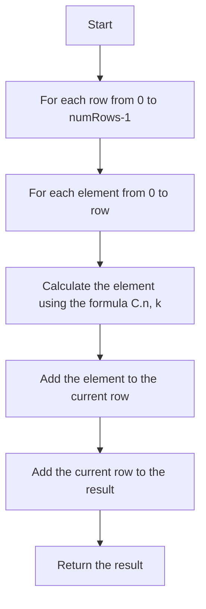

# 118. Pascal's Triangle

## Problem Statement

Given an integer `numRows`, return the first `numRows` of Pascal's triangle.

In Pascal's triangle, each number is the sum of the two numbers directly above it as shown:

```
    1
   1 1
  1 2 1
 1 3 3 1
1 4 6 4 1
```

### Example 1:
```
Input: numRows = 5
Output: [[1],[1,1],[1,2,1],[1,3,3,1],[1,4,6,4,1]]
```

### Example 2:
```
Input: numRows = 1
Output: [[1]]
```

---

## Approach

We can use certain `combinatorial` properties to generate the rows of Pascal's triangle.

The `k`-th element of the `n`-th row of Pascal's triangle can be calculated using the formula:

```
C(n, k) = n! / (k! * (n - k)!)
```
where `C(n, k)` is the binomial coefficient, which represents the number of ways to choose `k` elements from a set of `n` elements.

To generate the `n`-th row of Pascal's triangle, we can iterate from `0` to `n` and calculate the `k`-th element using the above formula.



---

## Code Implementation

```java
class Solution {
    private List<Integer> generateRow(int row){
        long ans = 1;
        List<Integer> res = new ArrayList<>();
        res.add(1);
        for(int col = 1; col < row; col++){
            ans = ans * (row - col);
            ans = ans / col;
            res.add((int) ans);
        }
        return res;
    }

    public List<List<Integer>> generate(int numRows) {
        List<List<Integer>> res = new ArrayList<>();
        for(int row = 1; row <= numRows; row++){
            res.add(generateRow(row));
        }        
        return res;
    }
}
```

---

## Complexity Analysis

- **Time Complexity**: O(numRows^2) - We are generating `numRows` rows and each row can have at most `numRows` elements.

- **Space Complexity**: O(numRows^2) - We are storing `numRows` rows and each row can have at most `numRows` elements.

---