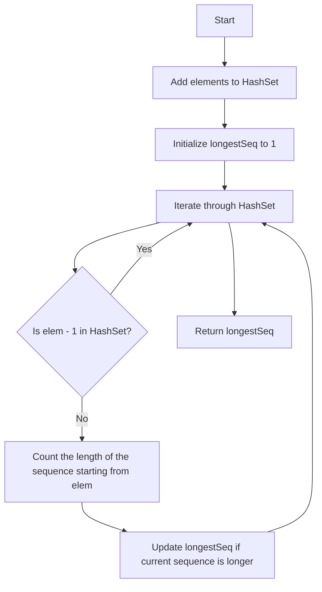

# 128. Longest Consecutive Sequence

## Problem Statement

Given an unsorted array of integers `nums`, return the length of the longest consecutive elements sequence.

### Example 1:
```
Input: nums = [100,4,200,1,3,2]
Output: 4
Explanation: The longest consecutive elements sequence is [1, 2, 3, 4]. Therefore its length is 4.
``` 

### Example 2:
```
Input: nums = [0,3,7,2,5,8,4,6,0,1]
Output: 9
Explanation: The longest consecutive elements sequence is [0, 1, 2, 3, 4, 5, 6, 7, 8]. Therefore its length is 9.
```

---

## Approach

The array is unsorted, can contain duplicates, and we need to find the `longest consecutive sequence`.

To solve this problem, we can use a `HashSet` to store the unique elements of the array. This allows us to check for the presence of elements in O(1) time.

1. Iterate through the array and add each element to the `HashSet`. This will help us to quickly check if a number exists in the set.

2. Initialize a variable `longestSeq` to keep track of the longest consecutive sequence found.

```
What can we observe about the longest consecutive sequence? If we have a number `x` in the set, and `x + 1` is also in the set, then `x` cannot be the start of a consecutive sequence. Therefore, we only want to start counting a sequence from numbers that are not preceded by another number in the set.
```

3. Iterate through the `HashSet` and for each element, check if it is the start of a sequence (i.e., check if `elem - 1` is not in the set). If it is the start of a sequence, we can then count how long the sequence is by checking for the presence of `elem + 1`, `elem + 2`, and so on until we find a number that is not in the set.

4. Update the `longestSeq` variable with the maximum length found.



---

## Code Implementation

```java
class Solution {
    public int longestConsecutive(int[] nums) {
        int n = nums.length;
        if(n == 0) return 0;
        
        Set<Integer> set = new HashSet<>();
        for(int i = 0; i < n; i++){
            set.add(nums[i]);
        }

        int longestSeq = 1;
        for(int elem: set){        
            if(set.contains(elem + 1)) continue;
            int currentSeq = 1;
            while(set.contains(elem - 1)){
                currentSeq++;
                elem--;
            }
            longestSeq = Math.max(longestSeq, currentSeq);
        }
        
        return longestSeq;    
    }
}
```

---

## Complexity Analysis

- **Time Complexity**: O(n), where n is the number of elements in the input array. We iterate through the array once to add elements to the set, and then we iterate through the set to find the longest consecutive sequence. Each element is processed at most twice (once when we check for the next element and once when we check for the previous element).

- **Space Complexity**: O(n), where n is the number of elements in the input array. In the worst case, all elements are unique and we store them in the set.

---