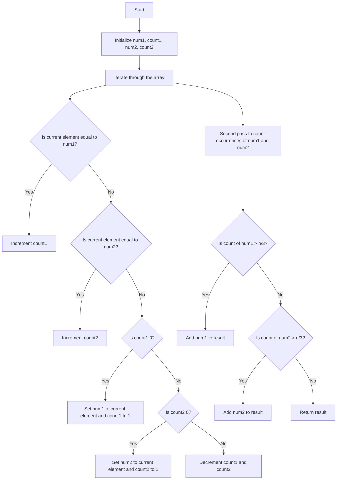

# 229. Majority Element II

## Problem Statement

Given an integer array of size `n`, find all elements that appear more than `⌊ n/3 ⌋` times.

### Example 1:
```
Input: nums = [3,2,3]
Output: [3]
```

### Example 2:
```
Input: nums = [1]
Output: [1]
```

### Example 3:
```
Input: nums = [1,2]
Output: [1,2]
```

---

## Approach

If you see the problem statement, it is asking us to find all elements that appear more than `n/3` times in the array.

When we check the test cases, we can see that there can be at most 2 elements that appear more than `n/3` times in the array, not more than that. We will use an algorithm called the `Boyer-Moore Voting Algorithm` to find these elements in O(n) time and O(1) space.

What does the `Boyer-Moore Voting Algorithm` do? 
It helps us find the majority element in an array. The majority element is the element that appears more than `n/2` times in the array.

1. We will maintain two candidate elements and their counts. Let's call them `num1`, `count1` and `num2`, `count2`.

2. We will iterate through the array and for each element, we will check if it is equal to `num1` or `num2`. If it is equal to `num1`, we will increment `count1`. If it is equal to `num2`, we will increment `count2`.

3. If the current element is not equal to `num1` or `num2`, we will check if `count1` is 0. If it is, we will set `num1` to the current element and set `count1` to 1. If `count1` is not 0, we will check if `count2` is 0. If it is, we will set `num2` to the current element and set `count2` to 1. If both `count1` and `count2` are not 0, we will decrement both `count1` and `count2`.

4. After the first pass, we will have two candidates for the majority element. We will then make a second pass through the array to count the occurrences of these two candidates.

5. Finally, we will check if the counts of these candidates are greater than `n/3` and add them to the result list if they are.



---

## Code Implementation

```java
class Solution {
    public List<Integer> majorityElement(int[] nums) {
        int n = nums.length;
        int count1 = 0, count2 = 0;
        int num1 = 0, num2 = 0;

        for(int i = 0; i < n; i++){
            if(count1 == 0 && nums[i] != num2){
                num1 = nums[i];
                count1++;
            }
            else if(count2 == 0 && nums[i] != num1){
                num2 = nums[i];
                count2++;
            }
            else if(nums[i] == num1) count1++;
            else if(nums[i] == num2) count2++;
            else{
                count1--; count2--;
            }
        }

        List<Integer> res = new ArrayList<>();
        count1 = 0; count2 = 0;
        for(int i = 0; i < n; i++){
            if(nums[i] == num1) count1++;
            else if(nums[i] == num2) count2++;
        }

        if(count1 > (n / 3)) res.add(num1);
        if(num2 != num1 && count2 > (n / 3)) res.add(num2);
        return res;
    }
}
```

---

## Complexity Analysis

- **Time Complexity**: O(n), where n is the length of the input array. We traverse the array a few times, but each traversal is O(n).

- **Space Complexity**: O(1), since we are using only a constant amount of extra space to store the counts and the potential majority elements.

---