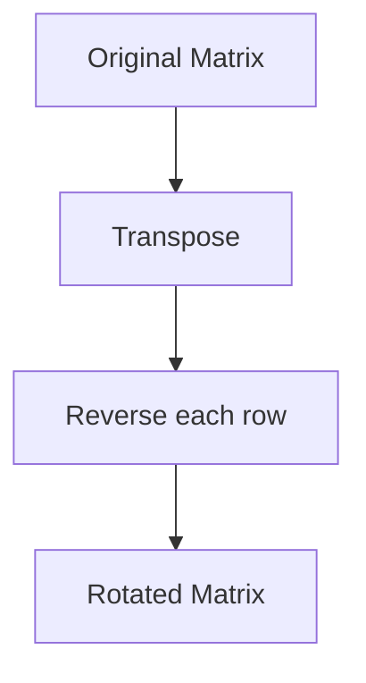

# 48. Rotate Image

## Problem Statement

You are given an `n x n` 2D matrix representing an image, rotate the image by 90 degrees (clockwise).

You have to rotate the image in-place, which means you have to modify the input 2D matrix directly. **DO NOT** allocate another 2D matrix and do the rotation.

### Example 1:

```
Input: matrix = [[1,2,3],[4,5,6],[7,8,9]]
Output: [[7,4,1],[8,5,2],[9,6,3]]
```

### Example 2:

```
Input: matrix = [[5,1,9,11],[2,4,8,10],[13,3,6,7],[15,14,12,16]]
Output: [[15,13,2,5],[14,3,4,1],[12,6,8,9],[16,7,10,11]]
```

---

## Approach

If we take a close look at the test cases, we can see that the `first` row of the original matrix becomes the `last` column of the rotated matrix, the `second` row becomes the `second last` column and so on.

To achieve this, we can first `transpose` the matrix and then `reverse` each rows of the transposed matrix.



---

## Code Implementation

```cpp
class Solution {
    public void rotate(int[][] matrix) {
        int n = matrix.length;
        for(int i = 0; i < n; i++){
            for(int j = i + 1; j < n; j++){
                swap(matrix, i, j);
            }
        }
        for(int i = 0; i < n; i++){
            reverse(matrix[i], 0, n - 1);
        }
    }

    private void swap(int[][] matrix, int i, int j){
        int temp = matrix[i][j];
        matrix[i][j] = matrix[j][i];
        matrix[j][i] = temp;
    }
    private void reverse(int[] arr, int l, int r){
        while(l < r){
            int temp = arr[l];
            arr[l] = arr[r];
            arr[r] = temp;
            l++; r--;
        }
    }
}
```

## Complexity Analysis

- **Time Complexity**: O(n^2) - We traverse the entire matrix twice, once for transposition and once for reversing each row.

- **Space Complexity**: O(1) - We are performing the operations in-place, so no additional space is used.

---