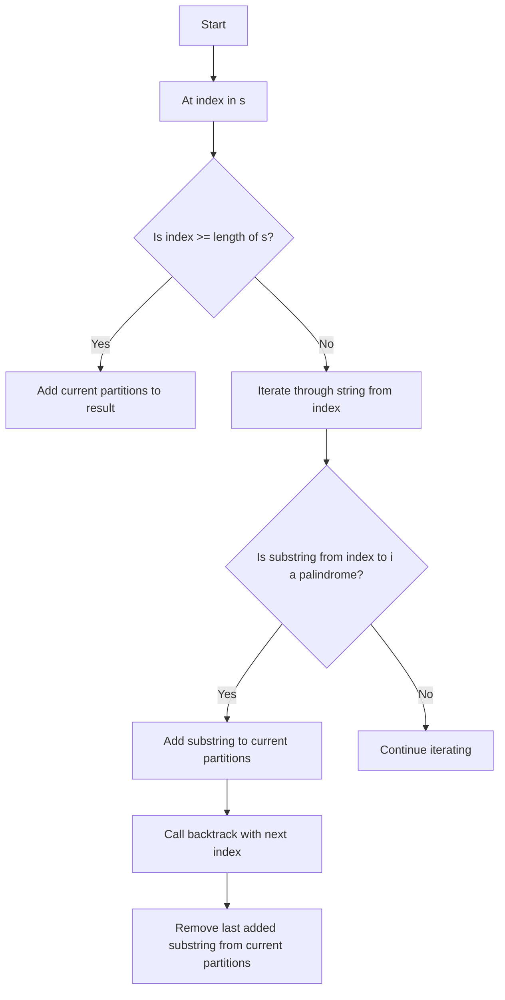

# 131. Palindrome Partitioning

## Problem Statement

Given a string `s`, partition `s` such that every substring of the partition is a palindrome.

Return all possible palindrome partitioning of `s`.

### Example 1:
```
Input: s = "aab"
Output: [["a","a","b"],["aa","b"]]
```

### Example 2:
```
Input: s = "a"
Output: [["a"]]
```

---

## Approach

To solve this problem, we can use the backtracking technique to explore all possible partitions of the string `s` and check if each partition is a palindrome.

1. We will define a helper function `isPalindrome` that checks if a given substring is a palindrome.

2. We will define a recursive function `backtrack` that takes the current index, the input string `s`, and the current list of partitions as parameters.

3. In the `backtrack` function, if the current index is greater than or equal to the length of the string, it means we have reached the end of the string and we can add the current list of partitions to our result list.

4. We will iterate through the string starting from the current index. For each index `i`, we will check if the substring from the current index to `i` is a palindrome using the `isPalindrome` function.

5. If the substring is a palindrome, we will add it to the current list of partitions and call the `backtrack` function recursively with the next index (`i + 1`).

6. After the recursive call, we will remove the last added substring from the current list of partitions to backtrack and explore other possibilities.


---

## Code Implementation

```java
class Solution {
    int n;
    List<List<String>> res;
    
    private boolean isPalindrome(String s, int l, int r){
        while(l <= r){
            if(s.charAt(l) != s.charAt(r)) return false;
            l++; r--;
        }
        return true;
    }

    private void backtrack(int index, String s, List<String> curr){
        if(index >= n){
            res.add(new ArrayList<>(curr));
            return;
        }
        for(int i = index; i < n; i++){
            if(isPalindrome(s, index, i)){
                curr.add(s.substring(index, i + 1));
                backtrack(i + 1, s, curr);
                curr.remove(curr.size() - 1);
            }
        }
    }

    public List<List<String>> partition(String s) {
        this.n = s.length();
        this.res = new ArrayList<>();
        List<String> curr = new ArrayList<>();
        backtrack(0, s, curr);
        return this.res; 
    }
}
```

---

## Complexity Analysis

- **Time Complexity**: O(n * 2^n), where `n` is the length of the input string `s`. This is because in the worst case, we might have to explore all possible partitions of the string, which can be up to 2^n. Additionally, checking if a substring is a palindrome takes O(n) time.

- **Space Complexity**: O(n), where `n` is the length of the input string `s`. This is because in the worst case, we might have to store a partition of all characters in the recursion stack. Additionally, the space used to store the result can also be O(n) in the worst case when all characters are the same and form a palindrome.

---