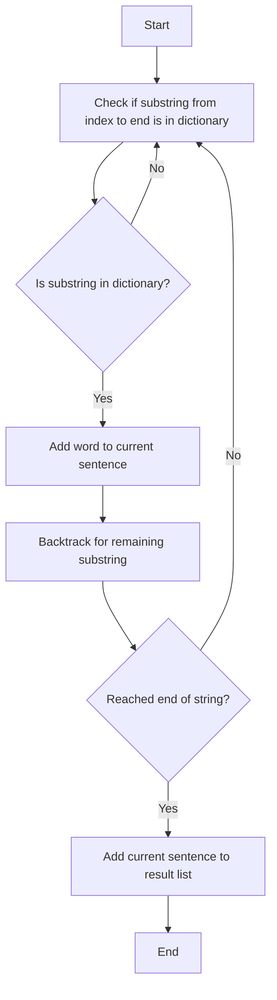

# 140. Word Break II

## Problem Statement

Given a string s and a dictionary of strings wordDict, return all possible sentences where each word is a valid dictionary word. The same word in the dictionary may be reused multiple times in the segmentation.

### Example 1:
```
Input: s = "catsanddog", wordDict = ["cat","cats","and","sand","dog"]
Output: ["cats and dog","cat sand dog"]
```

### Example 2:
```
Input: s = "pineapplepenapple", wordDict = ["apple","pen","applepen","pine","pineapple"]
Output: ["pine apple pen apple","pineapple pen apple","pine applepen apple"]
Explanation: Note that you are allowed to reuse a dictionary word.
```

### Example 3:
```
Input: s = "catsandog", wordDict = ["cats","dog","sand","and","cat"]
Output: []
```

---

## Approach

It is given that we can reuse the same word in the dictionary `multiple` times. So, we can use backtracking to find all possible sentences that can be formed by concatenating words from the dictionary.

For a `O(1)` lookup of words in the dictionary, we can store the words in a `HashSet`. 

We will start from the first character of the string `s` and check if the substring from the current index to the end of the string is present in the dictionary. If it is `present`, we will add that word to our current sentence and backtrack for the remaining substring.

We will continue this process until we reach the end of the string. If we reach the `end` of the string, it means we have found a `valid` sentence, and we will add that sentence to our result list.

In the case of `catsanddog`, we will start from the first character and check if `cat` is present in the dictionary. It is present, so we will add `cat` to our current sentence and backtrack for the remaining substring `sanddog`.

`sand` is present in the dictionary, so we will add `sand` to our current sentence and backtrack for the remaining substring `dog`. `dog` is present in the dictionary, so we will add `dog` to our current sentence and backtrack for the remaining substring which is empty. Since we have reached the end of the string, we will add the current sentence `cat sand dog` to our result list.


---

## Code Implementation

```cpp
class Solution {
public:
    unordered_set<string> words;
    vector<string> result;

    void backtrack(int index, string &curr, string s){
        if(index == s.length()){
            result.push_back(curr);
            return;
        }

        for(int i = index; i < s.length(); i++){
            string word = s.substr(index, i - index + 1);
            if(words.find(word) == words.end()) continue;
    
            string temp = curr;
            if(!curr.empty()) curr += " ";
            curr += word;
            backtrack(i + 1, curr, s);
            curr = temp;
        }
    }

    vector<string> wordBreak(string s, vector<string>& wordDict) {        
        for(string word: wordDict) words.insert(word);
        string currStr = "";
        backtrack(0, currStr, s);
        return result;
    }
};
```

---

## Complexity Analysis

- Time Complexity: `O(n^n)` in the worst case, where `n` is the length of the string `s`. This is because in the worst case, we can have a situation where every substring is a valid word in the dictionary, leading to an exponential number of combinations.

- Space Complexity: `O(n)` for the recursion stack in the worst case, where `n` is the length of the string `s`. Additionally, we are storing the result list which can also take up to `O(n^n)` space in the worst case if all combinations are valid sentences.

---