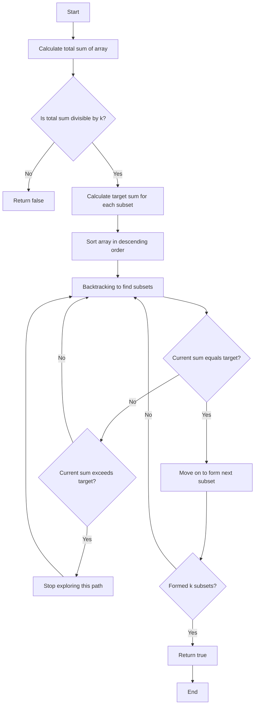

# 698. Partition to K Equal Sum Subsets

## Problem Statement

Given an array of integers `nums` and a positive integer `k`, determine if it is possible to divide this array into `k` non-empty subsets whose sums are all equal.

### Example 1:
```
Input: nums = [4,3,2,3,5,2,1], k = 4
Output: true
Explanation: It's possible to divide it into 4 subsets (5), (1, 4), (2,3), (2,3) with equal sums.
``` 

### Example 2:
```Input: nums = [1,2,3,4], k = 3
Output: false
``` 

---

## Approach

The problem is asking us to determine if we can partition the array into `k` subsets with equal sums. We can easily calculate the sum of all elements in the array and check if it is divisible by `k`. If it is not divisible, we can immediately return `false` since we cannot partition the array into `k` equal subsets.

If the total sum is divisible by `k`, we can calculate the `target` sum for each subset, which is `total_sum / k`. We can then use backtracking to explore all possible partitions of the array.

In order to `prune` our search space, we can `sort` the array in descending order. This way, if we find that the current sum exceeds the target, we can stop exploring that path further since adding more elements will only increase the sum.

We will maintain a `visited` array to keep track of which elements have been included in the current subset. We will also maintain a `current_sum` variable to keep track of the sum of the current subset we are building.

Starting from the first element, we will try to include it in the current subset and backtrack for the remaining elements. If the `current_sum` equals the `target`, it means we have successfully formed one subset, and we can move on to form the next subset.

If at any instance the current sum `exceeds` the target, we can stop right there because as the array is sorted, adding more elements will only increase the sum.

If we successfully form `k` subsets, we can return `true`. If we exhaust all possibilities and cannot form `k` subsets, we will return `false`.


---

## Code Implementation

```cpp
class Solution {
public:
    int target;
    vector<bool> visited;

    bool backtrack(int index, int currSum, int k, vector<int> &nums){
        if(k == 0) return true;
        if(currSum == target) return backtrack(0, 0, k - 1, nums);

        for(int i = index; i < nums.size(); i++){
            if(visited[i]) continue;
            if(currSum + nums[i] > target) break;
            visited[i] = true;
            if(backtrack(i + 1, currSum + nums[i], k, nums)) return true;
            visited[i] = false;
        }
        return false;
    }
    
    bool canPartitionKSubsets(vector<int>& nums, int k) {
        int n = nums.size();
        int totalSum = accumulate(nums.begin(), nums.end(), 0);
        if((totalSum % k) != 0) return false;

        this->visited.assign(n, false);
        this->target = (totalSum / k);
        
        sort(nums.begin(), nums.end());
        if(nums[n - 1] > target) return false;

        return backtrack(0, 0, k, nums);
    }
};
```
---

## Complexity Analysis

- Time Complexity: `O(k * 2^n)` in the worst case, where `n` is the number of elements in the array. This is because we are exploring all possible subsets of the array for each of the `k` subsets we need to form.

- Space Complexity: `O(n)` for the `visited` array and the recursive call stack in the worst case.

---