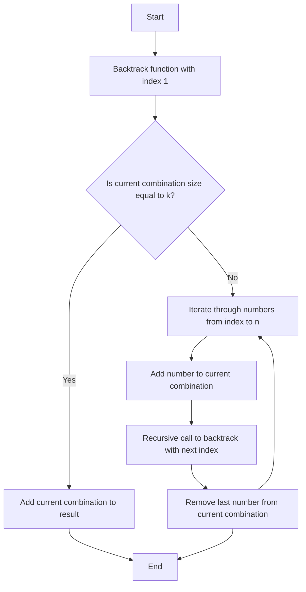

# 77. Combinations

## Problem Statement

Given two integers n and k, return all possible combinations of k numbers out of the range [1, n].

### Example 1:
```
Input: n = 4, k = 2
Output: [[1,2],[1,3],[1,4],[2,3],[2,4],[3,4]]
```

### Example 2:
```
Input: n = 1, k = 1
Output: [[1]]
```

---

## Approach

As we know to find all possible combinations of k we can use the formula `C(n, k) = n! / (k! * (n - k)!)`. 

To solve this problem, we can use a backtracking approach. We will try to build combinations by adding numbers from the range `[1, n]` one by one and checking if we have reached the required length of `k`. If we have reached the length of `k`, we will add the current combination to our result.

In the `backtrack` function, we will iterate through the numbers starting from the current index to n. For each number, we will add it to our current combination and recursively call the `backtrack` function with the next index.

After the recursive call, we will remove the last number from our current combination and continue to the next number in the loop.




---

## Code Implementation
```cpp
class Solution {
public:
    vector<vector<int>> result;
    
    void backtrack(int index, int n, int k, vector<int> &curr){
        if(curr.size() == k){
            result.push_back(curr);
            return;
        }
        
        for(int i = index; i <= n; i++){
            curr.push_back(i);
            backtrack(i + 1, n, k, curr);
            curr.pop_back();
        }
    }
    
    vector<vector<int>> combine(int n, int k) {
        vector<int> curr;
        backtrack(1, n, k, curr);
        return result;
    }
};
```

---

## Complexity Analysis

- **Time Complexity**: O(k * C(n, k)), where C(n, k) is the number of combinations. This is because we are generating C(n, k) combinations and each combination takes O(k) time to construct.

- **Space Complexity**: O(k) for the recursion stack.

---

