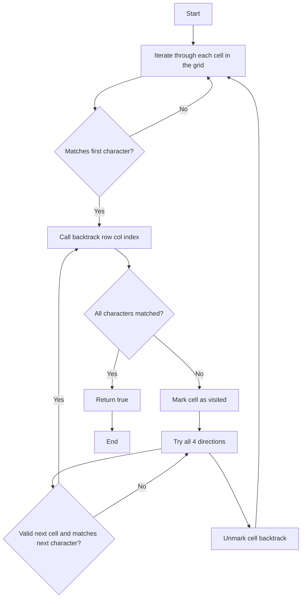

# 79. Word Search

## Problem Statement

Given an m x n grid of characters board and a string word, return true if word exists in the grid.

The word can be constructed from letters of sequentially adjacent cells, where adjacent cells are horizontally or vertically neighboring. The same letter cell may not be used more than once.

### Example 1:
```
Input: board = [["A","B","C","E"],["S","F","C","S"],["A","D","E","E"]], 
word = "ABCCED"
Output: true
```

### Example 2:
```Input: board = [["A","B","C","E"],["S","F","C","S"],["A","D","E","E"]], 
word = "SEE"
Output: true
```

### Example 3:
```Input: board = [["A","B","C","E"],["S","F","C","S"],["A","D","E","E"]], 
word = "ABCB"
Output: false
```

---

## Approach

To solve this problem, we can use a backtracking approach. We will iterate through each cell in the grid and try to find the word starting from that cell. Once we find the first character of the word, we will recursively check for the next characters in the adjacent cells `up, down, left, right`.

If the characters are matching we will progressively check for the next character in the word. If we find all characters in the word, we will return `true`. If we reach a cell that does not match the current character in the word, we will backtrack and try the next adjacent cell.

At each index, we will mark the cell as `visited` to avoid using the same cell more than once. After exploring all adjacent cells, we will unmark the cell as visited before backtracking.



---

## Code Implementation
```cpp
class Solution {
public:
    int n, m;
    
    bool backtrack(int index, int row, int col, vector<vector<char>>& board, string target){
        if(index == target.length()) return true;
        if(row < 0 || col < 0 || row >= n || col >= m) return false;
        if(board[row][col] != target[index]) return false;

        // If it matches, mark the cell as visited
        char orgChar = board[row][col];
        board[row][col] = '#';
        
        bool isPossible = (
            backtrack(index + 1, row + 1, col, board, target) || 
            backtrack(index + 1, row - 1, col, board, target) || 
            backtrack(index + 1, row, col + 1, board, target) || 
            backtrack(index + 1, row, col - 1, board, target)
        );
        
        // Unmark the visited cell
        board[row][col] = orgChar;
        return isPossible;
    }

    bool exist(vector<vector<char>>& board, string target) {
        this->n = board.size(), this->m = board[0].size();
        for(int i = 0; i < n; i++){
            for(int j = 0; j < m; j++){
                if(backtrack(0, i, j, board, target)) return true;
            }
        }
        return false;
    }
};
```

---

## Complexity Analysis

- **Time Complexity**: O(m * n * 4^L), where m and n are the dimensions of the board and L is the length of the word. In the worst case, we may have to explore all cells in the board and for each cell, we may have to explore 4 directions for each character in the word.

- **Space Complexity**: O(L) for the recursion stack, where L is the length of the word. In the worst case, we may have to explore all characters in the word.

---