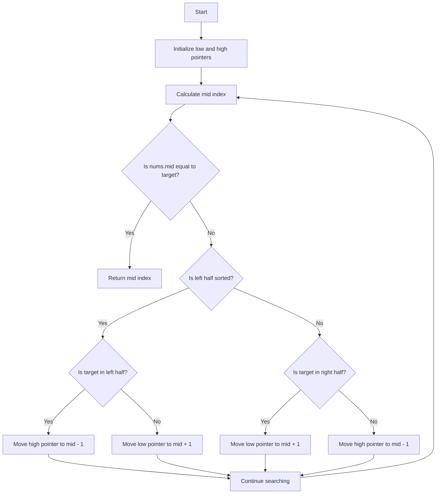

# 33. Search in Rotated Sorted Array

## Problem Statement

There is an integer array `nums` sorted in ascending order (with distinct values).

Prior to being passed to your function, `nums` is possibly rotated at an unknown pivot index `k` (1 <= k < nums.length) such that the resulting array is `[nums[k], nums[k+1], ..., nums[n-1], nums[0], nums[1], ..., nums[k-1]]` (0-indexed). For example, `[0,1,2,4,5,6,7]` might be rotated at pivot index 3 and become `[4,5,6,7,0,1,2]`.

Given the array `nums` after the possible rotation and an integer `target`, return the index of `target` if it is in `nums`, or -1 if it is not in `nums`.

### Example 1:
```
Input: nums = [4,5,6,7,0,1,2], target = 0
Output: 4
```

### Example 2:
```
Input: nums = [4,5,6,7,0,1,2], target = 3
Output: -1
```

---

## Approach


We can use a modified `binary search` to solve this problem. The idea is to determine which part of the array is `sorted` and then decide whether to search in the left or right half of the array based on the `target` value.

1. We initialize two pointers, `low` and `high`, to the start and end of the array, respectively.

2. We calculate the `mid` index and check if the value at `mid` is equal to the `target`. If it is, we return the `mid` index.

3. If the value at `low` is less than or equal to the value at `mid`, it means the left half of the array is sorted. We then check if the `target` is within the range of the sorted left half. If it is, we move the `high` pointer to `mid - 1` to search in the left half; otherwise, we move the `low` pointer to `mid + 1` to search in the right half.

4. If the value at `low` is greater than the value at `mid`, it means the right half of the array is sorted. We then check if the `target` is within the range of the sorted right half. If it is, we move the `low` pointer to `mid + 1` to search in the right half; otherwise, we move the `high` pointer to `mid - 1` to search in the left half.



---

## Code Implementation

```java
class Solution {    
    public int search(int[] nums, int target) {
        int n = nums.length;
        int low = 0, high = n - 1;

        while(low <= high){
            int mid = low + (high - low) / 2;
            if(nums[mid] == target) return mid;

            if(nums[low] <= nums[mid]){
                if(nums[low] <= target && target <= nums[mid]){
                    high = mid - 1;
                }
                else{
                    low = mid + 1;
                }
            }
            else{
                if(nums[mid] <= target && target <= nums[high]){
                    low = mid + 1;
                }
                else{
                    high = mid - 1;
                }
            }
        }
        return -1;
    }
}
```

---

## Complexity Analysis

- **Time Complexity**: O(log n), where n is the number of elements in the array. This is because we are performing a binary search.

- **Space Complexity**: O(1), since we are using only a constant amount of extra space for the pointers and variables.

---