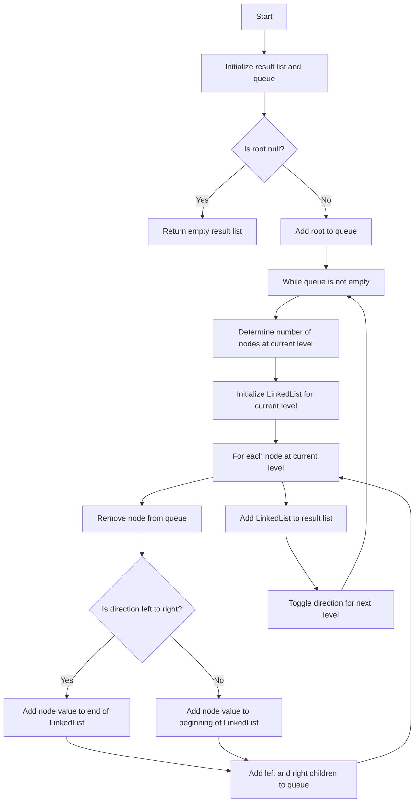

# 103. Binary Tree Zigzag Level Order Traversal

## Problem Statement

Given the `root` of a binary tree, return the zigzag level order traversal of its nodes' values. (i.e., from left to right, then right to left for the next level and alternate between).

### Example 1:
```
Input: root = [3,9,20,null,null,15,7]
Output: [[3],[20,9],[15,7]]
Explanation:
Level 0: left to right -> [3]
Level 1: right to left -> [20,9]
Level 2: left to right -> [15,7]
```

## Example 2:

```
Input: root = [1]
Output: [[1]]
```
---

## Approach

This is similar to a `level` order traversal of a binary tree, but we need to alternate the order of traversal for each level. We can use a `boolean` variable to keep track of the current direction of traversal (left to right or right to left).

1. Initialize a `result` list to store the final zigzag level order traversal and a queue to perform the breadth-first search `(BFS)` traversal.

2. If the `root` is `null`, return the empty result list. Otherwise, add the `root` node to the queue.

3. While the queue is not empty, do the following:
   - Determine the number of nodes at the current level (i.e., the size of the queue).
   - Initialize a `LinkedList` to store the values of the nodes at the current level.
   - For each node at the current level, remove it from the queue and add its value to the `LinkedList`. If the current direction is left to right, add the value to the end of the list; if it's right to left, add it to the beginning of the list.
   - Add the left and right children of the current node to the queue for processing in the next level.
   - After processing all nodes at the current level, add the `LinkedList` to the result list and toggle the direction for the next level.  



---

## Code Implementation

```java
class Solution {
    public List<List<Integer>> zigzagLevelOrder(TreeNode root) {
        List<List<Integer>> res = new ArrayList<>();
        if(root == null) return res;

        Queue<TreeNode> q = new LinkedList<>();
        q.offer(root);
        boolean isLeftToRight = true;
        
        while(!q.isEmpty()){
            int levelSize = q.size();
            LinkedList<Integer> curr = new LinkedList<>();
            
            for(int i = 0; i < levelSize; i++){
                TreeNode node = q.poll();                
                if(isLeftToRight){
                    curr.addLast(node.val);    
                }
                else{
                    curr.addFirst(node.val);    
                }
                if(node.left != null) q.offer(node.left);
                if(node.right != null) q.offer(node.right);
            }
            res.add(curr);
            isLeftToRight = !isLeftToRight;
        }
        return res;
    }
}
```  

---

## Complexity Analysis

- **Time Complexity**: O(N), where N is the number of nodes in the binary tree. We visit each node exactly once.

- **Space Complexity**: O(N), where N is the number of nodes in the binary tree. In the worst case, we may have to store all nodes in the queue (e.g., when the tree is a complete binary tree). Additionally, we are storing the result in a list which also takes O(N) space.

---
