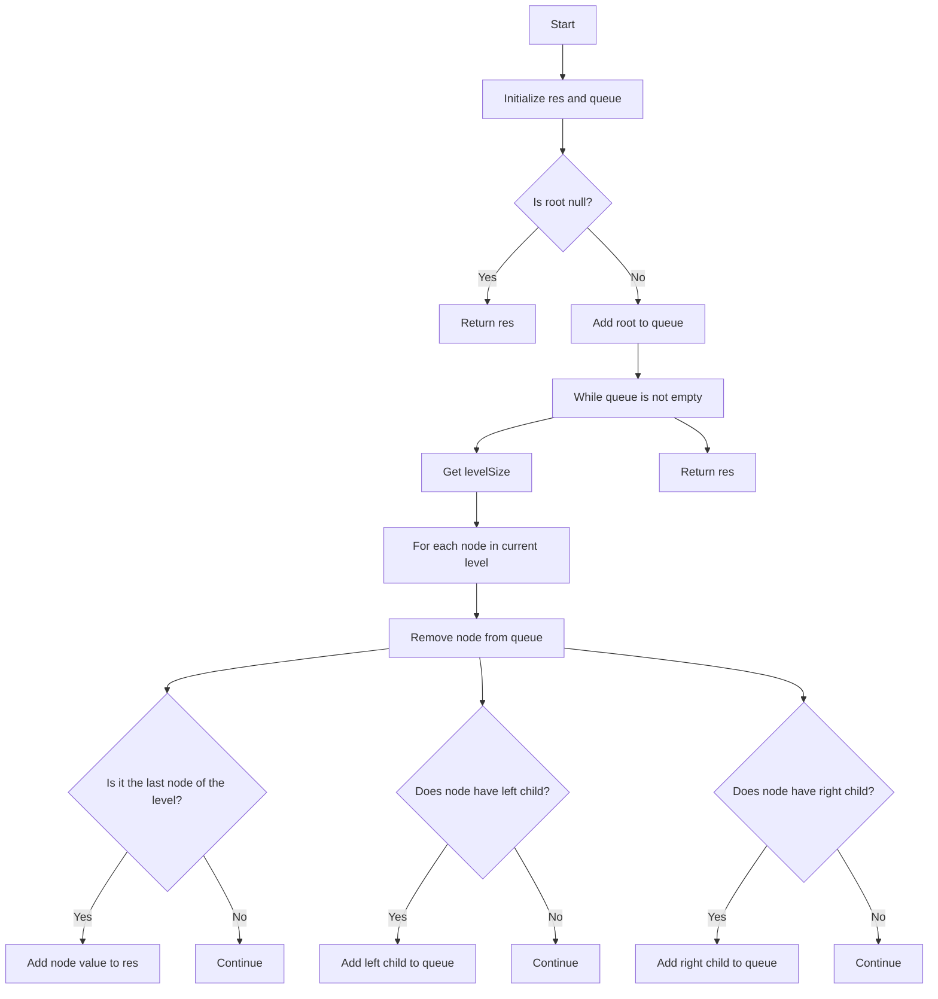

# 199. Binary Tree Right Side View

## Problem Statement

Given the `root` of a binary tree, imagine yourself standing on the right side of it, return the values of the nodes you can see ordered from top to bottom.

### Example 1:
```
Input: root = [1,2,3,null,5,null,4]
Output: [1,3,4]
```

### Example 2:
```
Input: root = [1,null,3]
Output: [1,3]
```

### Example 3:
```
Input: root = []
Output: []
```

---

## Approach

We are required to return the values of the nodes that are visible from the right side of a binary tree.

To solve this problem, we can perform a level order traversal (BFS) of the binary tree. During the traversal, we will keep track of the nodes at each level and add the last node of each level to our result list since that node will be visible from the right side.

Here are the steps to implement this approach:

1. Initialize an empty list `res` to store the result and a queue `q` to perform the level order traversal.

2. If the `root` is `null`, return the empty list `res`.

3. Add the `root` node to the queue.

4. While the queue is not empty, do the following:
   - Get the number of nodes at the current level (let's call it `levelSize`).
   - For each node at the current level, do the following:
     - Remove the node from the front of the queue.
     - If it is the last node of the current level (i.e., `i == levelSize`), add its value to the result list `res`.
     - If the node has a left child, add it to the queue.
     - If the node has a right child, add it to the queue.



---

## Code Implementation

```java

class Solution {
    public List<Integer> rightSideView(TreeNode root) {
        List<Integer> res = new ArrayList<>();
        if(root == null) return res;

        Queue<TreeNode> q = new LinkedList<>();
        q.offer(root);

        while(!q.isEmpty()){
            int levelSize = q.size();
            
            for(int i = 1; i <= levelSize; i++){
                TreeNode node = q.peek(); q.poll();
                if(i == levelSize) res.add(node.val);
                
                if(node.left != null) q.offer(node.left);                
                if(node.right != null) q.offer(node.right);
            }
        }
        return res;
    }
}
```

---

## Complexity Analysis

- **Time Complexity**: O(n), where `n` is the number of nodes in the binary tree. We visit each node exactly once.

- **Space Complexity**: O(w), where `w` is the maximum width of the binary tree. In the worst case, this can be O(n) if the tree is a complete binary tree.

---