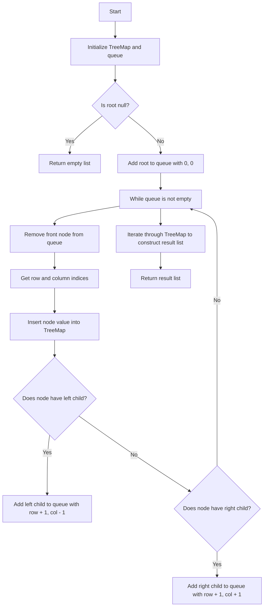

# 987. Vertical Order Traversal of a Binary Tree

## Problem Statement

Given the `root` of a binary tree, calculate the vertical order traversal of the binary tree.

The vertical order traversal of a binary tree is a list of top-to-bottom orderings for each column index starting from the leftmost column and ending on the rightmost column. There may be multiple nodes in the same row and same column. In such a case, sort these nodes by their values.

### Example 1:
```
Input: root = [3,9,20,null,null,15,7]
Output: [[9],[3,15],[20],[7]]
Explanation:
Without loss of generality, we can assume the node at (X, Y) = (0, 0) is the root.
Then, the node with value 9 occurs at (X, Y) = (-1, -1);
The nodes with values 3 and 15 occur at (X, Y) = (0, 0) and (X, Y) = (0, -2), respectively.
The node with value 20 occurs at (X, Y) = (1, -1);
The node with value 7 occurs at (X, Y) = (2, -2).
```

---

## Approach

What are we asked to find? We are required to return the `vertical` order traversal of a binary tree.

To solve this problem, we can perform a breadth-first search `(BFS)` traversal of the binary tree while keeping track of the `row` and `column` indices of each node. 

We can use a `TreeMap` to store the nodes based on their column indices, and within each column, we can use another `TreeMap` to store the nodes based on their row indices. If there are multiple nodes in the same row and column, we can use a `PriorityQueue` to sort these nodes by their values.

- Why a `TreeMap`? A `TreeMap` will automatically sort the keys (column and row indices) in natural order, which helps us to easily retrieve the nodes in the correct vertical order.

Insert nodes into the `TreeMap` during the BFS traversal, and then construct the result list by iterating through the `TreeMap` and retrieving the nodes in the required order.

- We can use a `PriorityQueue` to store the node values for nodes that share the same row and column, ensuring that they are sorted by their values.

1. Initialize a `TreeMap` to store the nodes based on their column and row indices, and a queue to perform the BFS traversal.

2. If the `root` is `null`, return an empty list. Otherwise, add the `root` node to the queue with its initial row and column indices (0, 0).

3. While the queue is not empty, do the following:
   - Remove the front node from the queue and get its row and column indices.
   - Insert the node's value into the `TreeMap` based on its column and row indices.
   - If the node has a left child, add it to the queue with updated row and column indices (row + 1, col - 1).
   - If the node has a right child, add it to the queue with updated row and column indices (row + 1, col + 1).

4. After the BFS traversal, iterate through the `TreeMap` to construct the result list. For each column, retrieve the nodes in order of their row indices and add them to the result list.



---

## Code Implementation

```java
class Solution {
    class Tuple{
        TreeNode node;
        int row; int col;
        Tuple(TreeNode node, int row, int col){
            this.node = node;
            this.row = row;
            this.col = col;
        }
    }
    public List<List<Integer>> verticalTraversal(TreeNode root) {
        TreeMap<Integer, TreeMap<Integer, PriorityQueue<Integer>>> map = new TreeMap<>();
        Queue<Tuple> q = new LinkedList<>();

        q.offer(new Tuple(root, 0, 0));
        while(!q.isEmpty()){
            Tuple tuple = q.poll();
            TreeNode node = tuple.node;
            int row = tuple.row, col = tuple.col;

            if(!map.containsKey(col)){
                map.put(col, new TreeMap<>());
            }
            if(!map.get(col).containsKey(row)){
                map.get(col).put(row, new PriorityQueue<>());
            }            
            map.get(col).get(row).offer(node.val);

            if(node.left != null){
                q.offer(new Tuple(node.left, row + 1, col - 1));
            }
            if(node.right != null){
                q.offer(new Tuple(node.right, row + 1, col + 1));
            }
        }

        List<List<Integer>> res = new ArrayList<>();
        for(TreeMap<Integer, PriorityQueue<Integer>> mp: map.values()){
            List<Integer> curr = new ArrayList<>();
            for(PriorityQueue<Integer> pq: mp.values()){
                while(!pq.isEmpty()){
                    curr.add(pq.poll());
                }
            }
            res.add(new ArrayList<>(curr));
        }
        return res;
    }
}
```

---

## Complexity Analysis

- **Time Complexity**: O(N log N), where N is the number of nodes in the binary tree. This is because we are inserting nodes into a TreeMap, which takes O(log N) time for each insertion, and we are doing this for all N nodes.

- **Space Complexity**: O(N), where N is the number of nodes in the binary tree. This is because we are storing all the nodes in a TreeMap, and in the worst case, all nodes could be in the same vertical line, leading to O(N) space usage.

---