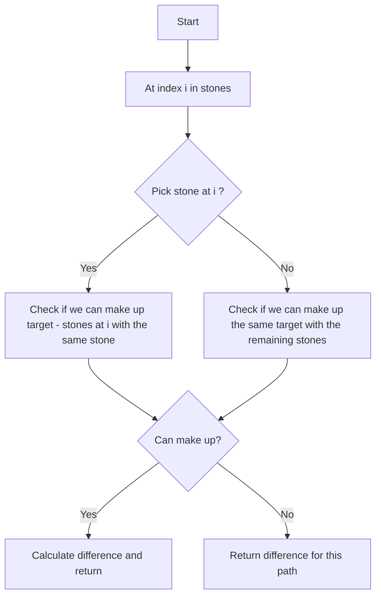

# Last Stone Weight II

## Problem Statement

You are given an array of integers `stones` where `stones[i]` is the weight of the `i`-th stone. We are playing a game with the stones. On each turn, we choose any two stones and smash them together. Suppose the stones have weights `x` and `y` with `x <= y`. The result of this smash is:

- If `x == y`, both stones are totally destroyed;

- If `x != y`, the stone of weight `x` is totally destroyed, and the stone of weight `y` has new weight `y - x`.

At the end of the game, there is at most one stone left. Return the smallest possible weight of the left stone. If there are no stones left, return `0`.

### Example 1:
```
Input: stones = [2,7,4,1,8,1]
Output: 1
Explanation: We can combine the stones as follows:
- Combine 7 and 8 to get 1, so the array converts to [2,4,1,1,1] then,
- Combine 2 and 4 to get 2, so the array converts to [2,1,1,1] then,
- Combine 2 and 1 to get 1, so the array converts to [1,1,1] then,
- Combine 1 and 1 to get 0, so the array converts to [1] then that's the value of the last stone.
```

### Example 2:
```
Input: stones = [31,26,33,21,40]
Output: 5
```

### Example 3:

```
Input: stones = [1,2]
Output: 1
```

---

## Approach

We have to find the smallest possible weight of the last remaining stone after smashing stones together. This is equivalent to `partitioning` the stones into two groups such that the difference between the sum of weights in the two groups is `minimized`.

We'll find the total sum of the stones, and then we want to find a subset of stones that has a sum as close to `total_sum / 2` as possible. This is because if we can find a subset with a sum close to half of the total, the other subset will also be close to half, minimizing the difference.

`target = total_sum // 2`

At each index `i` in the `stones` array, we have two choices:

- **Pick the current stone**: If we pick the current stone `stones[i]`, we need to check if we can make up the remaining target `currSum + stones[i]` using the same stone (since we can only use each stone once).

- **Don't pick the current stone**: If we don't pick the current stone, we need to check if we can make up the same target using the remaining stones (i.e., move to the next index).

When we reach the end of the `stones` array, we can calculate the difference between the two groups and return it.

Another pruning can be done by checking if `currSum` is already greater than or equal to `target`. If it is, we can directly calculate the difference and return it without further exploration.




---

## Code Implementation

```cpp
class Solution {
public:
    int totalSum;
    int target;
    vector<vector<int>> dp;
    
    int subsetWithMinAbsDiff(int index, int currSum, vector<int> &nums){
        if(currSum >= target || index == nums.size()){
            return abs(currSum - (totalSum - currSum));
        }    
        if(dp[index][currSum] != -1) return dp[index][currSum];    
        
        int noPick = subsetWithMinAbsDiff(index + 1, currSum, nums);
        int pick = subsetWithMinAbsDiff(index + 1, currSum + nums[index], nums);
        return dp[index][currSum] = min(pick, noPick);
    }

    int lastStoneWeightII(vector<int>& stones) {
        int n = stones.size();      
        this->totalSum = accumulate(stones.begin(), stones.end(), 0);
        this->target = totalSum / 2;       
        this->dp.assign(n, vector<int> (totalSum + 1, -1));
        return subsetWithMinAbsDiff(0, 0, stones);
    }
};
```

---

## Complexity Analysis

- **Time Complexity**: `O(n * totalSum)`, where `n` is the number of stones and `totalSum` is the sum of all stone weights. This is because we are using a 2D DP array of size `n x totalSum`.

- **Space Complexity**: `O(n * totalSum)` for the DP array. Additionally, the recursion stack can go up to `O(n)` in the worst case, so the overall space complexity is `O(n * totalSum)`.

---