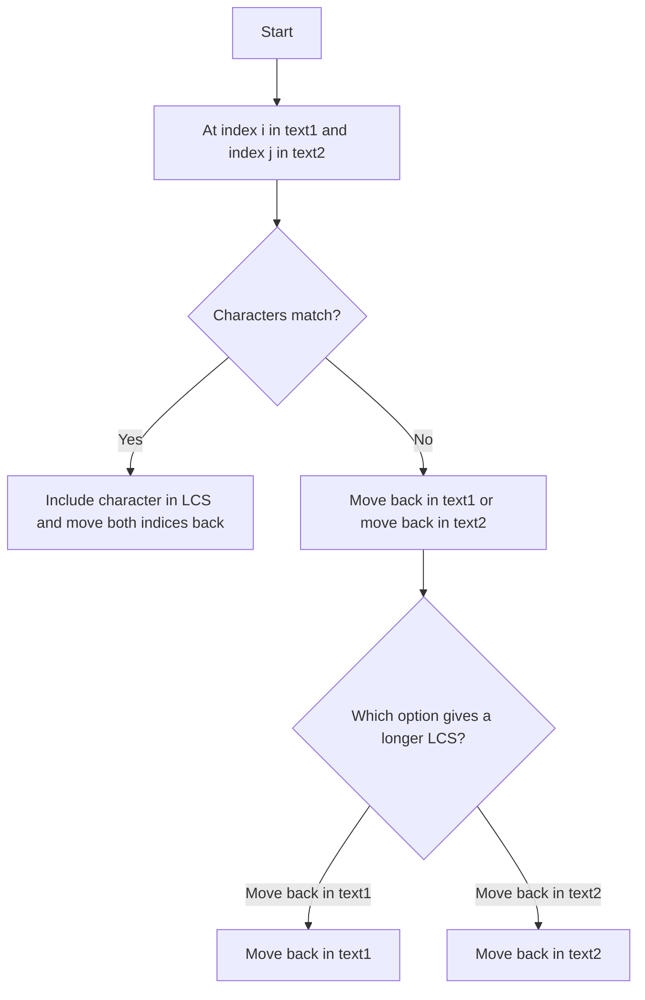

# 1143. Longest Common Subsequence

## Problem Statement

Given two strings `text1` and `text2`, return the length of their longest common subsequence. If there is no common subsequence, return `0`.

A subsequence of a string is a new string generated from the original string with some characters (can be none) deleted without changing the relative order of the remaining characters. For example, `"ace"` is a subsequence of `"abcde"`.

### Example 1:
```
Input: text1 = "abcde", text2 = "ace"
Output: 3
Explanation: The longest common subsequence is "ace" and its length is 3.
```

### Example 2:
```
Input: text1 = "abc", text2 = "abc"
Output: 3
Explanation: The longest common subsequence is "abc" and its length is 3.
```

### Example 3:
```
Input: text1 = "abc", text2 = "def"
Output: 0
Explanation: There is no such common subsequence, so the result is 0.
```

---

## Approach

**What is a subsequence?**  

A `subsequence` is a sequence that can be derived from another sequence by deleting some or no elements without changing the order of the remaining elements. For example, `ace` is a subsequence of `abcde`, but `aec` is not.

We can solve this problem using the `LCS` strategy. If at any index `i` in `text1` and index `j` in `text2`, the characters match, we can include that character in our longest common subsequence and move both indices back by one. 

If the characters do not match, we have two options: either we can move back in `text1` or we can move back in `text2`. We will take the maximum of these two options to ensure we are always keeping track of the longest common subsequence found so far.

Suppose `text1 = "abcde"` and `text2 = "ace"`.

-  Index `i` in `text1` is at 'e' and index `j` in `text2` is at 'e'. Since they match, we include 'e' in our LCS and move both indices back.

-  Now, index `i` in `text1` is at 'd' and index `j` in `text2` is at 'c'. Since they do not match, we have two options: move back in `text1` to 'c' or move back in `text2` to 'a'. We will take the maximum of these two options.

- Suppose we move back in `text1` to 'c'. Now, index `i` in `text1` is at 'c' and index `j` in `text2` is at 'c'. Since they match, we include 'c' in our LCS and move both indices back. 

- This way we can continue this process until we have traversed both strings, and the length of the longest common subsequence will be the count of matched characters.

- If at any point we reach the end of either string, we will stop and return the length of the longest common subsequence found so far.





---

## Code Implementation

```cpp
class Solution {
public:
    vector<vector<int>> dp;
    
    int findLCS(int i, int j, string &text1, string &text2){
        if(i < 0 || j < 0) return 0;
        
        if(dp[i][j] != -1) return dp[i][j];
        
        if(text1[i] == text2[j]){
            return dp[i][j] = 1 + findLCS(i - 1, j - 1, text1, text2);
        }
        return dp[i][j] = max(findLCS(i - 1, j, text1, text2), 
            findLCS(i, j - 1, text1, text2));
    }

    int longestCommonSubsequence(string text1, string text2) {
        int n = text1.length(), m = text2.length();
        this->dp.assign(n, vector<int> (m, -1));
        return findLCS(n - 1, m - 1, text1, text2);
    }
};
```

---

## Complexity Analysis

-  **Time Complexity**: The time complexity of this solution is `O(n * m)`, where `n` and `m` are the lengths of `text1` and `text2` respectively. This is because we are filling a 2D DP table of size `n x m`.

-  **Space Complexity**: The space complexity is also `O(n * m)` due to the DP table we are using to store the results of subproblems. However, we can optimize this to `O(min(n, m))` by using a 1D DP array instead of a 2D DP table, since we only need the previous row's values to compute the current row.

---