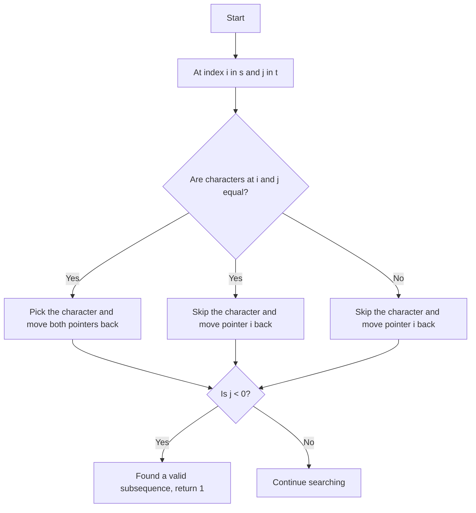

# Distinct Subsequences

## Problem Statement

Given two strings `s` and `t`, return the number of distinct subsequences of `s` which equals `t`.

A string's subsequence is a new string formed from the original string by deleting some (can be none) of the characters without disturbing the remaining characters' relative positions. (i.e., `"ACE"` is a subsequence of `"ABCDE"` while `"AEC"` is not).

### Example 1:
```
Input: s = "rabbbit", t = "rabbit"
Output: 3
Explanation:
As shown below, there are 3 ways you can generate "rabbit" from S.
rabbbit
rabbbit
rabbbit
```

### Example 2:
```
Input: s = "babgbag", t = "bag"
Output: 5
Explanation:
As shown below, there are 5 ways you can generate "bag" from S.
babgbag
babgbag
babgbag
babgbag
babgbag
```

---

## Approach

We need to find the number of distinct subsequences of `s` that equals `t`.

How will we know that we have found a valid subsequence? Suppose we are traversing through the string `s` and we have a pointer `i` for `s` and a pointer `j` for `t`. 

If at any instance `j` becomes less than 0, it means we have found a valid subsequence of `s` that equals `t`. If `i` becomes less than 0 and `j` is still greater than or equal to 0, it means we have exhausted all characters in `s` without finding a valid subsequence that equals `t`.

If the characters at `s[i]` and `t[j]` are equal, we have two choices:

1. We can pick the character `s[i]` and move both pointers `i` and `j` one step back.

2. We can skip the character `s[i]` and move the pointer `i` one step back while keeping the pointer `j` unchanged.

- Why do we do this? Because there might be multiple occurrences of the same character in `s` that can match with the character at `t[j]`. So, we need to explore both possibilities. 

If the characters at `s[i]` and `t[j]` are not equal, we can only skip the character `s[i]` and move the pointer `i` one step back while keeping the pointer `j` unchanged.



---

## Code Implementation

```cpp
class Solution {
public:
    vector<vector<int>> dp;
    
    int countWays(int i, int j, string &s, string &t){
        if(j < 0) return 1;
        if(i < 0) return 0;

        if(dp[i][j] != -1) return dp[i][j];
        if(s[i] == t[j]){
            return dp[i][j] = (
                countWays(i - 1, j - 1, s, t) + 
                countWays(i - 1, j, s, t));
        }
        else{
            return dp[i][j] = countWays(i - 1, j, s, t);
        }
    }

    int numDistinct(string s, string t) {
        int n = s.length(), m = t.length();
        this->dp.assign(n + 1, vector<int>(m + 1, -1));
        return countWays(n - 1, m - 1, s, t);
    }
};
```

---

## Complexity Analysis

- **Time Complexity**: O(n * m), where `n` is the length of string `s` and `m` is the length of string `t`. This is because we are filling a DP table of size `n x m`.

- **Space Complexity**: O(n * m) for the DP table. Additionally, the recursion stack can go up to O(n + m) in the worst case, but since we are using memoization, the overall space complexity is dominated by the DP table.

---