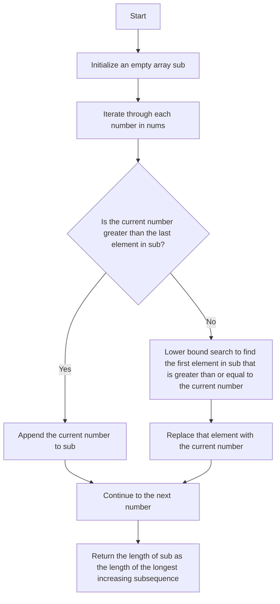

# 300. Longest Increasing Subsequence

## Problem Statement

Given an integer array `nums`, return the length of the longest strictly increasing subsequence.

### Example 1:
```
Input: nums = [10,9,2,5,3,7,101,18]
Output: 4   
Explanation: The longest increasing subsequence is [2,3,7,101], therefore the length is 4.
```

### Example 2:
```
Input: nums = [0,1,0,3,2,3]
Output: 4
Explanation: The longest increasing subsequence is [0,1,2,3], therefore the length is 4.
```

### Example 3:
```
Input: nums = [7,7,7,7,7,7,7]
Output: 1
Explanation: The longest increasing subsequence is [7], therefore the length is 1.
```

---

## Approach 1: Dynamic Programming

We have to find the length of the longest strictly increasing subsequence in an array.

For a particular index `i`, if we know the length of the longest increasing subsequence that ends at index `i`, we can use that information to find the length of the longest increasing subsequence that ends at index `i+1`.

i.e., if `nums[i] < nums[i+1]`, then the longest increasing subsequence that ends at index `i+1` can be formed by appending `nums[i+1]` to the longest increasing subsequence that ends at index `i`.

In this way, we can build up the solution for the entire array by iterating through it and keeping track of the longest increasing subsequence that ends at each index.

### Code Implementation
```cpp
class Solution {
public:
    int lengthOfLIS(vector<int>& nums) {
        int n = nums.size();
        vector<vector<int>>dp (n + 1, vector<int> (n + 1, 0));
        
        for(int idx = n - 1; idx >= 0; idx--){
            for(int prevIdx = idx - 1; prevIdx >= -1; prevIdx--){
                int noPick = 0 + dp[idx + 1][prevIdx + 1];
                int pick = 0; 
                if(prevIdx == -1 || nums[idx] > nums[prevIdx]){
                    pick = 1 + dp[idx + 1][idx + 1];
                }        
                dp[idx][prevIdx + 1] = max(pick, noPick);
            }
        }
        return dp[0][0];
    }
};
```

### Complexity Analysis

- **Time Complexity**: O(n^2) - We have two nested loops that iterate through the array.

- **Space Complexity**: O(n^2) - We are using a 2D DP array of size `n x n` to store the results of subproblems.

---

## Approach 2: Binary Search (Patience Sorting Algorithm)

In the previous approach, we used a `2D` DP array to store the length of the longest increasing subsequence that ends at each index. However, we can optimize this approach using binary search.

We can maintain an array `sub` where `sub[i]` is the smallest possible tail value of an increasing subsequence of length `i+1`.

When we iterate through the input array `nums`, if we encounter a number that is larger than the last element in `sub`, we can append it to `sub`. 

Otherwise we can use binary search (`lower_bound`) to find the first element in `sub` that is greater than or equal to the current number and replace it with the current number.



### Code Implementation
```cpp
class Solution {
public:
    int lengthOfLIS(vector<int>& nums) {
        int n = nums.size();
        vector<int> res;
        res.push_back(nums[0]);
        int len = 1;
        
        for(int i = 1; i < n; i++){
            if(nums[i] > res.back()){
                res.push_back(nums[i]);
                len++;
            }
            else{
                int index = lower_bound(res.begin(), res.end(), nums[i]) - res.begin();
                res[index] = nums[i];
            }
        }
        return len;
    }
};
```

### Complexity Analysis

- **Time Complexity**: O(n log n) - We iterate through the array once and for each element, we perform a binary search on the `sub` array.

- **Space Complexity**: O(n) - In the worst case, the `sub` array can grow to the size of the input array if all elements are increasing.

---