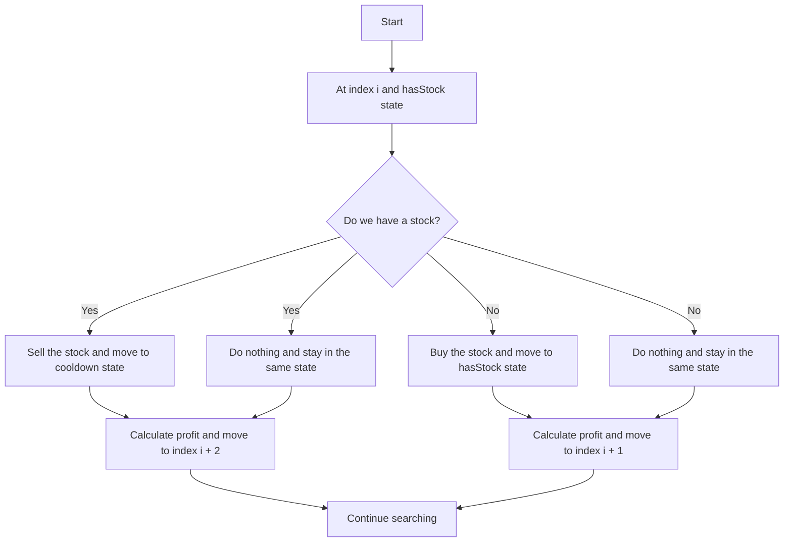

# 309. Best Time to Buy and Sell Stock with Cooldown

## Problem Statement

You are given an array `prices` where `prices[i]` is the price of a given stock on the `i`-th day. 

Find the maximum profit you can achieve. You may complete as many transactions as you like (i.e., buy one and sell one share of the stock multiple times) with the following restrictions:

- After you sell your stock, you cannot buy stock on the next day (i.e., cooldown one day).

**Note:** You may not engage in multiple transactions simultaneously (i.e., you must sell the stock before you buy again).

### Example 1:
```
Input: prices = [1,2,3,0,2]
Output: 3
Explanation: transactions = [buy, sell, cooldown, buy, sell]
```

### Example 2:
```
Input: prices = [1]
Output: 0
Explanation: There is no way to make a profit, so we never buy the stock to achieve the maximum profit of 0.
``` 

---

## Approach

We need to find the maximum profit from stock trading with a cooldown period after selling.
For each day, we have `two` states: whether we have a stock or not.

If we have a stock, we can either `sell` it and move to the `cooldown` state or do nothing and stay in the same state.

If we do not have a stock, we can either `buy` it and move to the state where we have a stock or do nothing and stay in the same state.

We need to explore both possibilities for each state and take the maximum profit from both.



---

## Code Implementation

```cpp
class Solution {
public:
    vector<vector<int>> dp;
    int calculate(int index, int hasStock, vector<int> &prices){
        if(index >= prices.size()) return 0;
        if(dp[index][hasStock] != -1) return dp[index][hasStock];

        if(hasStock == 1){
            return dp[index][hasStock] = max(
                prices[index] + calculate(index + 2, 0, prices),
                0 + calculate(index + 1, 1, prices)
            );
        }
        else{
            return dp[index][hasStock] = max(
                -prices[index] + calculate(index + 1, 1, prices),
                0 + calculate(index + 1, 0, prices)
            );
        }
    }
  
    int maxProfit(vector<int>& prices) {
        int n = prices.size();
        this->dp.assign(n + 1, vector<int> (2, -1));
        return calculate(0, 0, prices);      
    }
};
```
---

## Complexity Analysis

- **Time Complexity**: O(n), where `n` is the number of days (length of the `prices` array). This is because we are filling a DP table of size `n x 2`.

- **Space Complexity**: O(n), due to the DP table used for memoization. The recursive call stack will also take O(n) space in the worst case.

---

