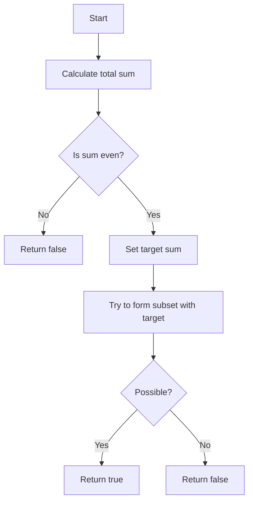

# 416. Partition Equal Subset Sum

## Problem Statement

Given an integer array `nums`, return `true` if you can partition the array into two subsets such that the sum of the elements in both subsets is equal or `false` otherwise.

### Example 1:
```
Input: nums = [1,5,11,5]
Output: true
Explanation: The array can be partitioned as [1, 5, 5] and [11].
``` 

### Example 2:
```
Input: nums = [1,2,3,5]
Output: false
Explanation: The array cannot be partitioned into equal sum subsets.
```

---

## Approach

**When can we actually partition the array into two subsets with equal sums?**

- This is only possible if the total sum of the array is even. If the total sum is odd, we can immediately return `false` because we cannot split an odd number into two equal integers.

- If the total sum is even, we can set our `target` sum to be `totalSum / 2`. Now, the problem reduces to finding if there exists a subset of the array that sums up to this `target`.

**While traversing through the array, at each index `i`, we have two choices:**

1. **Pick the current element**: If we pick the current element `nums[i]`, we need to check if we can find a subset in the remaining elements that sums up to `target - nums[i]`.

2. **Don't pick the current element**: If we don't pick the current element, we need to check if we can find a subset in the remaining elements that sums up to `target`.

If at any point we find a subset that sums up to `target`, we can return `true`. If we exhaust all possibilities and do not find such a subset, we return `false`.

To keep the time complexity manageable, we can use a 2D DP table to store the results of subproblems. The DP table will have dimensions `n x (target + 1)`, where `n` is the number of elements in the input array.




## Code Implementation

```cpp
class Solution {
public:
    vector<vector<int>> dp;
    
    int partition(int index, int target, vector<int> &nums){
        if(index < 0) return false;
        if(target == 0) return dp[index][target] = true;
        if(nums[index] == target) return dp[index][target] = true;
        if(dp[index][target] != -1) return dp[index][target];

        int noPick = partition(index - 1, target, nums);
        int pick = 0;
        if(target - nums[index] >= 0){
            pick = partition(index - 1, target - nums[index], nums);
        }
        return dp[index][target] = pick || noPick;
    }

    bool canPartition(vector<int>& nums) {
        int n = nums.size();
        int totalSum = accumulate(nums.begin(), nums.end(), 0);
        if(totalSum % 2 != 0) return false;

        int target = (totalSum / 2);
        this->dp.assign(n, vector<int> (totalSum + 1, -1));
        return partition(n - 1, target, nums);
    }
};
```

---

## Complexity Analysis

- Time Complexity: O(n * target), where n is the number of elements in the input array and target is the sum we are trying to achieve (which is half of the total sum of the array). This is because we are filling a 2D DP table of size n x target.

- Space Complexity: O(n * target) for the DP table. However, we can optimize this to O(target) by using a 1D DP array instead of a 2D array, since we only need the previous row to compute the current row.

---