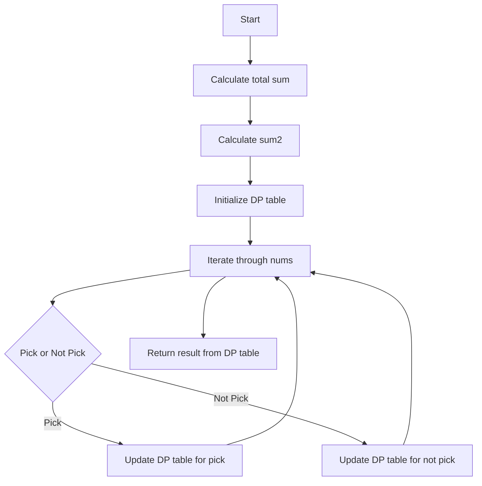

# 494. Target Sum

## Problem Statement

You are given an integer array `nums` and an integer `target`. You want to build an expression out of `nums` by adding one of the symbols `'+'` and `'-'` before each integer in `nums` and then concatenate all the integers.  

- For example, if `nums = [2, 1]`, you can add a `'+'` before `2` and a `'-'` before `1` and concatenate them to build the expression `"+2-1"`.

Return the number of different expressions that you can build, which evaluates to `target`.

### Example 1:
```
Input: nums = [1,1,1,1,1], target = 3
Output: 5
Explanation: There are 5 ways to assign symbols to make the sum of nums be target:
-1 + 1 + 1 + 1 + 1 = 3
+1 - 1 + 1 + 1 + 1 = 3  
+1 + 1 - 1 + 1 + 1 = 3
+1 + 1 + 1 - 1 + 1 = 3
+1 + 1 + 1 + 1 - 1 = 3
```

### Example 2:
```
Input: nums = [1], target = 1
Output: 1
Explanation: There is only one way to assign symbols to make the sum of nums be target:
+1 = 1
```

---

## Approach

To solve this problem, we can use a dynamic programming approach. The idea is to explore all possible combinations of adding '+' and '-' before each number in the `nums` array and keep track of the number of ways to achieve the `target` sum.

The main idea is we can translate this question into another form. How?
So we are given a `target` and we have to find the number of ways to assign symbols to make the sum of `nums` be `target`. 

Let `sum1` be the sum of the numbers with a '+' sign and `sum2` be the sum of the numbers with a '-' sign. We can derive the following equations:

```
sum1 + sum2 = target (i)
sum1 = totalSum - sum2 (ii)
from (i) and (ii):
sum2 = (totalSum - target) / 2;
```

Now, the problem reduces to finding the number of subsets in `nums` that sum up to `sum2`. This is a classic subset sum problem that can be solved using dynamic programming.

We can use a `pick` or `not pick` approach to explore all possible combinations of numbers in `nums` and count how many of those combinations sum up to `sum2`. We can use a 2D DP table to store the results of subproblems, where the dimensions are `n x (sum2 + 1)`, with `n` being the number of elements in `nums`.



---

## Code Implementation

```cpp
class Solution {
public:
    vector<vector<int>> dp;
    int findWays(int index, int target, vector<int> &nums){
        if(index == 0){
            if(target == 0 && nums[index] == 0) return 2;
            if(target == 0 || target == nums[index]) return 1;
            else return 0;
        }
        if(dp[index][target] != -1) return dp[index][target];
        
        int noPick = findWays(index - 1, target, nums);
        int pick = 0;
        if(nums[index] <= target){
            pick = findWays(index - 1, target - nums[index], nums);
        }
        return dp[index][target] = noPick + pick;
    }

    int findTargetSumWays(vector<int>& nums, int diff) {
        int n = nums.size();
        int totalSum = accumulate(nums.begin(), nums.end(), 0);
        if(totalSum < diff || (totalSum - diff) % 2 != 0) return 0; 
        int target = (totalSum - diff) / 2;
        
        dp.assign(n, vector<int> (target + 1, -1));
        return findWays(n - 1, target, nums);
    }
};
```

---

## Complexity Analysis

- **Time Complexity**: The time complexity of this solution is O(n * target), where `n` is the number of elements in the `nums` array and `target` is the sum we are trying to achieve. This is because we are filling a DP table of size `n x (target + 1)`.

- **Space Complexity**: The space complexity is also O(n * target) due to the DP table we are using to store the results of subproblems.

---