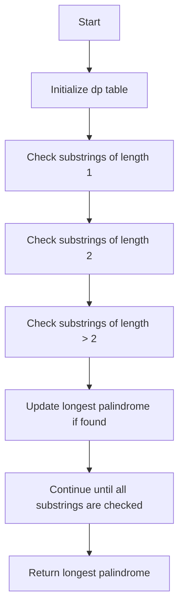

# 5. Longest Palindromic Substring

## Problem Statement

Given a string `s`, return the longest palindromic substring in `s`.

## Example 1:
```
Input: s = "babad"
Output: "aba"
Explanation: "aba" is a palindrome substring of "babad". Note that "aba" is also a valid answer.
```

## Example 2:
```
Input: s = "cbbd"
Output: "bb"
```

## Example 3:
```
Input: s = "a"
Output: "a"
```

---

## Approach

We have to find the longest palindromic substring in a given string. We can use a `2D dynamic programming` approach to solve this problem.

We can create a `dp` table where `dp[i][j]` will be `true` if the substring from index `i` to index `j` is a palindrome, and `false` otherwise.

To fill this table, we can use the following rules:

1. All substrings of length 1 are palindromes, so we can initialize `dp[i][i] = true` for all `i`.

2. For substrings of length 2, we can check if the two characters are the same. If they are, then `dp[i][i+1] = true`.

3. For substrings of length greater than 2, we can check if the first and last characters are the same and if the substring between them is a palindrome. If both conditions are satisfied, then `dp[i][j] = true`.

We can iterate through all possible substrings and fill the `dp` table accordingly. While filling the table, we can keep track of the longest palindrome found so far.



---

## Code Implementation

```cpp
class Solution {
public:
    vector<vector<int>> dp;
    bool isPalindrome(string &s, int l, int r){
        if(l >= r) return true;
        if(dp[l][r] != -1) return dp[l][r];
        if(s[l] == s[r]) return dp[l][r] = isPalindrome(s, l + 1, r - 1);        
        return false;
    }
    string longestPalindrome(string s) {
        int n = s.length();
        this->dp.assign(n, vector<int> (n, -1));
        int maxLen = 0, startIndex = 0;
        for(int i = 0; i < n; i++){
            for(int j = i; j < n; j++){
                if(isPalindrome(s, i, j)){
                    if(j - i + 1 > maxLen){
                        maxLen = j - i + 1;
                        startIndex = i;
                    }
                }
            }
        }
        return s.substr(startIndex, maxLen);
    }
};
```

---

## Complexity Analysis

- **Time Complexity**: O(n^2), where n is the length of the input string. This is because we are checking all possible substrings and each check takes O(1) time due to memoization.

- **Space Complexity**: O(n^2) for the dp table used for memoization. In the worst case, we may store results for all possible substrings.

---