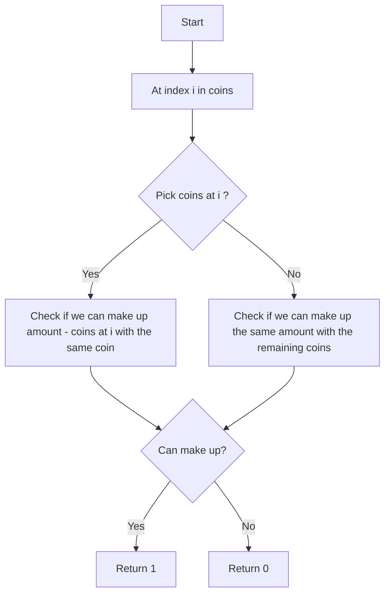

# 518. Coin Change 2

## Problem Statement

You are given an integer array `coins` representing coins of different denominations and an integer `amount` representing a total amount of money.

Return the number of combinations that make up that amount. If that amount of money cannot be made up by any combination of the coins, return `0`.

You may assume that you have an infinite number of each kind of coin.

### Example 1:
```
Input: amount = 5, coins = [1,2,5]
Output: 4
Explanation: there are four ways to make up the amount:
5=5
5=2+2+1
5=2+1+1+1
5=1+1+1+1+1 
```

### Example 2:
```
Input: amount = 3, coins = [2]
Output: 0
Explanation: the amount of money cannot be made up just with coins of denomination 2.
```

### Example 3:
```
Input: amount = 10, coins = [10]
Output: 1
```

---

## Approach

We can easily solve this problem using our `pick` and `not pick` approach. At each index `i` in the `coins` array, we have two choices:

- **Pick the current coin**: If we pick the current coin `coins[i]`, we need to check if we can make up the remaining amount `amount - coins[i]` using the same coin (since we have an infinite number of each kind of coin).

- **Don't pick the current coin**: If we don't pick the current coin, we need to check if we can make up the same amount using the remaining coins (i.e., move to the next index).

When we reach the end of the `coins` array, if the remaining amount is `0`, it means we have found a valid combination, and we can return `1`. If the remaining amount is not `0`, it means this path does not lead to a valid combination, and we can return `0`.



---

## Code Implementation

```cpp
class Solution {
public:
    vector<vector<int>> dp;
    
    int pickCoins(int index, int amount, vector<int> &coins){
        if(amount == 0) return 1;
        if(index == 0){
            if(amount % coins[index] == 0) return 1;
            else return 0;
        }
        if(dp[index][amount] != -1) return dp[index][amount];
        
        int noPick = pickCoins(index - 1, amount, coins);
        int pick = 0;
        if(coins[index] <= amount){
            pick = pickCoins(index, amount - coins[index], coins);
        }
        
        return dp[index][amount] = pick + noPick;
    }

    int change(int amount, vector<int>& coins) {
        int n = coins.size();
        this->dp.assign(n, vector<int> (amount + 1, -1));
        return pickCoins(n - 1, amount, coins);
    }
};
```

---

## Complexity Analysis

- **Time Complexity**: The time complexity of this approach is `O(n * amount)`, where `n` is the number of coins and `amount` is the total amount we want to make up. This is because we are filling a DP table of size `n x (amount + 1)`.

- **Space Complexity**: The space complexity is also `O(n * amount)` due to the DP table we are using to store the results of subproblems.

---