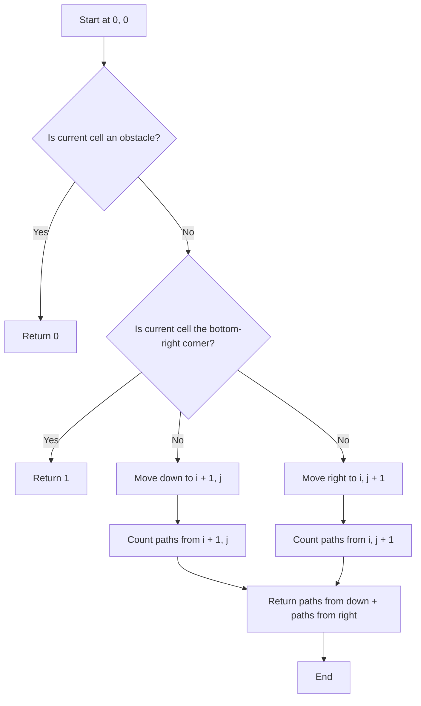

# 63. Unique Paths II

## Problem Statement

A robot is located at the top-left corner of a `m x n` grid (marked 'Start' in the diagram below).
The robot can only move either down or right at any point in time. The robot is trying to reach the bottom-right corner of the grid (marked 'Finish' in the diagram below).

Now consider if some obstacles are added to the grids. How many unique paths would there be?
An obstacle and space is marked as `1` and `0` respectively in the grid.

### Example 1:

```
Input: obstacleGrid = [[0,0,0],[0,1,0],[0,0,0]]
Output: 2
Explanation: There is one obstacle in the middle of the 3x3 grid above. There are two ways to reach the bottom-right corner:
1. Right -> Right -> Down -> Down
2. Down -> Down -> Right -> Right
```

### Example 2:

```
Input: obstacleGrid = [[0,1],[0,0]]
Output: 1
```

---

## Approach

We can count the number of paths from the top-left corner to the bottom-right corner using a recursive approach with memoization (dynamic programming).

We will define a recursive function `countPaths(i, j)` that returns the number of unique paths from the cell `(i, j)` to the bottom-right corner.

At each cell `(i, j)`, we have two options: move down to `(i + 1, j)` or move right to `(i, j + 1)`. The number of paths from `(i, j)` will be the sum of the paths from these two options.

However, if the current cell `(i, j)` is an obstacle (i.e., `obstacleGrid[i][j] == 1`), then there are no paths from that cell, and we should return `0`.



---

## Code Implementation

```cpp
class Solution {
public:
    int n, m;
    vector<vector<int>> dp;
    
    int countPaths(int i, int j, vector<vector<int>> &grid){
        if(i == n - 1 && j == m - 1 && grid[i][j] != 1) return 1;
        if(grid[i][j] == 1) return 0;
        if(dp[i][j] != -1) return dp[i][j];

        int down = 0, right = 0;
        if(i + 1 < n){
            down = countPaths(i + 1, j, grid);
        }
        if(j + 1 < m){
            right = countPaths(i, j + 1, grid);
        }
        return dp[i][j] = (down + right);
    }
    
    int uniquePathsWithObstacles(vector<vector<int>> &grid) {
        this->n = grid.size();
        this->m = grid[0].size();
        this->dp.assign(n, vector<int> (m, -1));
        return countPaths(0, 0, grid);
    }
};
```

---

## Complexity Analysis

- **Time Complexity**: O(n * m), where n is the number of rows and m is the number of columns in the grid. This is because we are calculating the number of paths for each cell at most once due to memoization.

- **Space Complexity**: O(n * m) for the dp array used for memoization, and O(n + m) for the recursive call stack in the worst case.

---