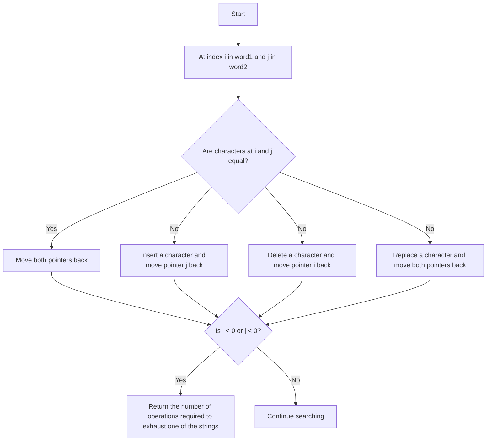

# 72. Edit Distance

# Problem Statement

Given two strings `word1` and `word2`, return the minimum number of operations required to convert `word1` to `word2`.

You have the following three operations permitted on a word:

1. Insert a character
2. Delete a character
3. Replace a character

### Example 1:
```
Input: word1 = "horse", word2 = "ros"
Output: 3
Explanation:
horse -> rorse (replace 'h' with 'r')
rorse -> rose (remove 'r')
rose -> ros (remove 'e')
```

### Example 2:
```
Input: word1 = "intention", word2 = "execution"
Output: 5
Explanation:
intention -> inention (remove 't')
inention -> enention (replace 'i' with 'e')
enention -> exention (replace 'n' with 'x')
exention -> exection (replace 'n' with 'c') 
exection -> execution (insert 'u')
``` 

---

## Approach

Our goal is to find the minimum number of operations required to convert `word1` to `word2`.

We can perform three operations: insert, delete, and replace.

Suppose we take two pointers `i` and `j` for `word1` and `word2` respectively, starting from the end of both strings.
If the characters at `word1[i]` and `word2[j]` are the same, we can simply move both pointers one step back without performing any operation.

If the characters at `word1[i]` and `word2[j]` are different, we have three options:

1. Insert a character: We can insert the character `word2[j]` into `word1` at position `i + 1`. This will make the characters at `i` and `j` match, so we can move the pointer `j` one step back while keeping the pointer `i` unchanged.

2. Delete a character: We can delete the character `word1[i]`. This will make the characters at `i` and `j` match, so we can move the pointer `i` one step back while keeping the pointer `j` unchanged.

3. Replace a character: We can replace the character `word1[i]` with `word2[j]`. This will make the characters at `i` and `j` match, so we can move both pointers one step back.

If any of the pointers `i` or `j` becomes less than 0, it means we have exhausted one of the strings. If `i` becomes less than 0, it means we need to insert the remaining characters of `word2` into `word1`, which will require `j + 1` operations. If `j` becomes less than 0, it means we need to delete the remaining characters of `word1`, which will require `i + 1` operations.



---

## Code Implementation

```cpp
class Solution {
public:
    vector<vector<int>> dp;

    int matchChars(int i, int j, string &s1, string &s2){
        if(i < 0) return j + 1;
        if(j < 0) return i + 1;
        if(dp[i][j] != -1) return dp[i][j];

        if(s1[i] == s2[j]){
            return dp[i][j] = matchChars(i - 1, j - 1, s1, s2);
        }
        else{
            return dp[i][j] = min({
                1 + matchChars(i - 1, j, s1, s2),
                1 + matchChars(i, j - 1, s1, s2),
                1 + matchChars(i - 1, j - 1, s1, s2)
        });
        }
    }

    int minDistance(string word1, string word2) {
        int n = word1.length(), m = word2.length();
        this->dp.assign(n, vector<int> (m, -1));
        return matchChars(n - 1, m - 1, word1, word2);
    }
};
```

---

## Complexity Analysis

- **Time Complexity**: O(n * m), where `n` is the length of `word1` and `m` is the length of `word2`. This is because we are filling a DP table of size `n x m`.

- **Space Complexity**: O(n * m) for the DP table. However, we can optimize this to O(min(n, m)) by using a rolling array since we only need the previous row or column at any time.

---