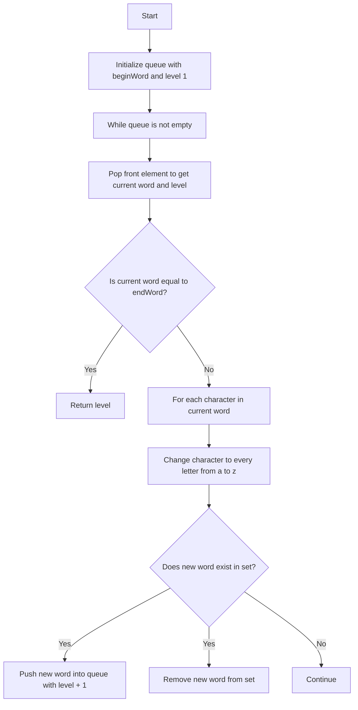

# 127. Word Ladder

## Problem Statement

Given two words, `beginWord` and `endWord`, and a dictionary's word list, return the length of the shortest transformation sequence from `beginWord` to `endWord`, such that:

1. Only one letter can be changed at a time.
2. Each transformed word must exist in the word list.

Note that `beginWord` is not a transformed word.

### Example 1:
```
Input: beginWord = "hit", endWord = "cog", wordList = ["hot","dot","dog","lot","log","cog"]
Output: 5
Explanation: As one shortest transformation is "hit" -> "hot" -> "dot" -> "dog" -> "cog", return its length 5.
``` 

### Example 2:
```
Input: beginWord = "hit", endWord = "cog", wordList = ["hot","dot","dog","lot","log"]
Output: 0
Explanation: The endWord "cog" is not in wordList, therefore no possible transformation.
```

---

## Approach

We need to find the length of the shortest transformation sequence from `beginWord` to `endWord`. We are given a list of valid words that can be used in the transformation.

To get the lookups of the words in the word list to be `O(1)`, we can store the words in an unordered set. We can then use a queue to perform a breadth-first search (BFS) starting from `beginWord`.

If the `endWord` is not in the word list, we can immediately return 0 since it's impossible to transform `beginWord` to `endWord`.

Push the `beginWord` into the queue along with the initial level (length of the transformation sequence) which is 1.

While the queue is not empty, we can pop the front element which will give us the current word and the level. If the current word is equal to `endWord`, we can return the level as it represents the length of the transformation sequence.

For each character in the current word, we can try changing it to every letter from `a` to `z` and check if the new word exists in the set. If it does, we can push the new word into the queue with the level incremented by 1 and remove it from the set to avoid cycles.



---

## Code Implementation

```cpp
class Solution {
public:
    int ladderLength(string beginWord, string endWord, vector<string>& wordList) {
        unordered_set<string> st(wordList.begin(), wordList.end());
        queue<pair<string, int>> q;
        q.push({beginWord, 1});

        while(!q.empty()){
            auto [word, level] = q.front(); q.pop();
            if(word == endWord) return level;

            for(int i = 0; i < word.size(); i++){
                char org = word[i];
                for(char ch = 'a'; ch <= 'z'; ch++){
                    if(ch == org) continue;
                    word[i] = ch;
                    if(st.find(word) != st.end()){
                        q.push({word, level + 1});
                        st.erase(word);
                    }
                }
                word[i] = org;
            }
        }
        return 0;
    }
};
```

---

## Time Complexity

- **Time Complexity**: O(N * M^2), where N is the number of words in the word list and M is the length of each word. This is because for each word, we are generating M possible transformations and checking if they exist in the set.

- **Space Complexity**: O(N), where N is the number of words in the word list. This is because we are storing all the words in a set for O(1) lookups, and the queue can also grow up to O(N) in the worst case.

---