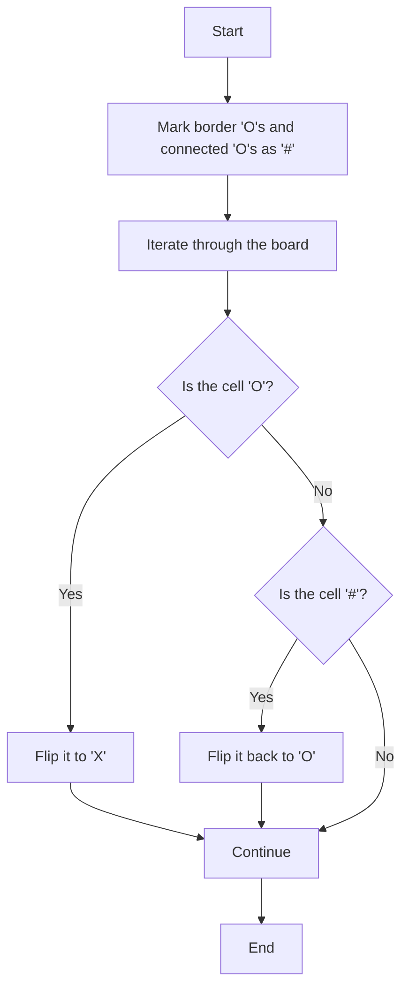

# 130. Surrounded Regions

## Problem Statement

Given an `m x n` matrix `board` containing `'X'` and `'O'`, capture all regions that are 4-directionally surrounded by `'X'`.

A region is captured by flipping all `'O'`s into `'X'`s in that surrounded region.

To capture a surrounded region, replace all `'O's` with `'X's` in-place within the original board. You do not need to return anything.


## Example 1

```
Input: board = [["X","X","X","X"],["X","O","O","X"],["X","X","O","X"],["X","O","X","X"]]
Output: [["X","X","X","X"],["X","X","X","X"],["X","X","X","X"],["X","O","X","X"]]

Explanation: Surrounded regions should not be on the border, which means that any 'O' on the border of the board are not flipped to 'X'. Any 'O' that is not on the border and it is not connected to an 'O' on the border will be flipped to 'X'. Two cells are connected if they are adjacent cells connected horizontally or vertically.
```

## Example 2

```
Input: board = [["X"]]
Output: [["X"]]
```

## Example 3

```
Input: board = [["X","O"],["O","X"]]
Output: [["X","O"],["O","X"]]
``` 

---

## Approach

What do you mean by a `surrounded region`? A surrounded region is a group of `'O'`s that are completely surrounded by `'X'`s. This means that any `'O'` that is on the border of the board cannot be part of a surrounded region, and any `'O'` that is connected to an `'O'` on the border cannot be part of a surrounded region.

We can use this property to solve the problem. We can start by marking all the `'O'`s that are on the border and all the `'O'`s that are connected to them as `'#'`. Use a `dfs()` function to mark all the `'O'`s that are connected to the border as `'#'`. 

Once its done on all the borders, we can iterate through the board and flip all the remaining `'O'`s to `'X'`s, and flip all the `'#'`s back to `'O'`s.

This way, we can capture all the surrounded regions in-place without using any extra space.



---

## Code Implementation

```cpp
class Solution {
public:
    int n, m;
    
    void dfs(int i, int j, vector<vector<char>> &board){
        if(i < 0 || j < 0 || i >= n || j >= m || board[i][j] != 'O') return;
        board[i][j] = '#';
        dfs(i + 1, j, board);
        dfs(i - 1, j, board);
        dfs(i, j + 1, board);
        dfs(i, j - 1, board);
    }
    
    void solve(vector<vector<char>>& board) {
        this->n = board.size();
        this->m = board[0].size();

        for(int i = 0; i < n; i++){
            dfs(i, 0, board);
            dfs(i, m - 1, board);
        }

        for(int j = 0; j < m; j++){
            dfs(0, j, board);
            dfs(n - 1, j, board);
        }

        for(int i = 0; i < n; i++){
            for(int j = 0; j < m; j++){
                if(board[i][j] == 'O'){
                    board[i][j] = 'X';
                }
                else if(board[i][j] == '#'){
                    board[i][j] = 'O';
                }
            }
        }
    }
};
```

---

## Complexity Analysis

- **Time Complexity**: O(n * m), where n is the number of rows and m is the number of columns in the board. We visit each cell at most once during the DFS traversal.

- **Space Complexity**: O(n * m) in the worst case, if the board is filled with 'O's and we have to mark all of them as '#'. However, in practice, the space complexity is O(min(n, m)) due to the recursive call stack of DFS.

---