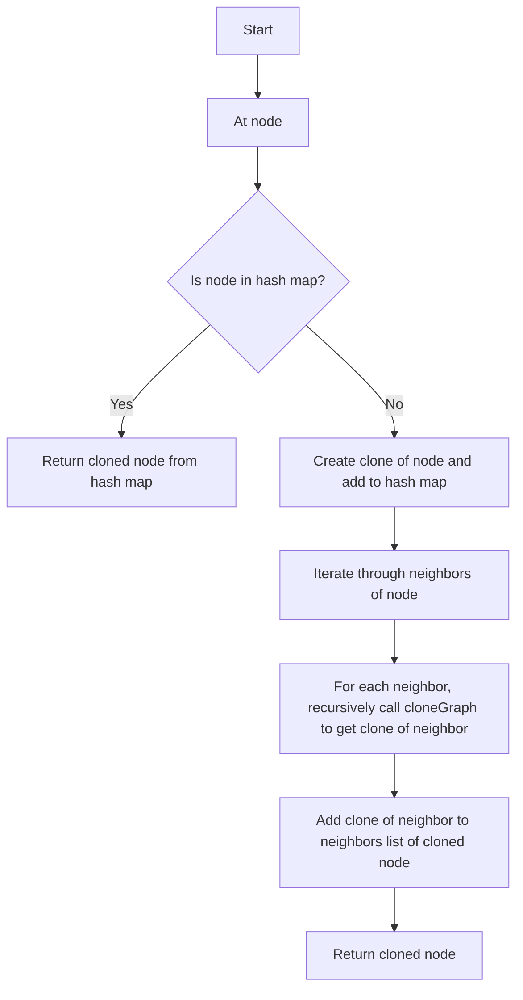

# 133. Clone Graph

## Problem Statement

Given a reference of a node in a connected undirected graph, return a deep copy (clone) of the graph.
Each node in the graph contains a value (int) and a list (List[Node]) of its neighbors.

### Example 1:
```
Input: adjList = [[2,4],[1,3],[2,4],[1,3]]
Output: [[2,4],[1,3],[2,4],[1,3]]
Explanation: There are 4 nodes in the graph.
1st node (val = 1)'s neighbors are 2nd node (val = 2) and 4th node (val = 4).
2nd node (val = 2)'s neighbors are 1st node (val = 1) and 3rd node (val = 3).
3rd node (val = 3)'s neighbors are 2nd node (val = 2) and 4th node (val = 4).
4th node (val = 4)'s neighbors are 1st node (val = 1) and 3rd node (val = 3).
``` 

### Example 2:
```
Input: adjList = [[]]
Output: [[]]
Explanation: Note that the input contains one empty list. The graph consists of only one node with val = 1 and it does not have any neighbors.
``` 

### Example 3:
```
Input: adjList = []
Output: []
Explanation: This an empty graph, it does not have any nodes.
```     

---

## Approach

We have to create a deep copy of the given graph. We can use Depth-First Search (DFS) to traverse the graph and create a clone of each node.

We will use a `hash map` to keep track of the nodes that have already been cloned. The key of the hash map will be the original node and the value will be the cloned node.

Let's say we are currently at a node `node`. If `node` is already present in the hash map, it means we have already cloned this node, so we can simply return the cloned node from the hash map. 

If `node` is not present in the hash map, we will create a clone of this node and add it to the hash map. Then, we will iterate through the neighbors of `node` and for each neighbor, we will recursively call the `cloneGraph` function to get the clone of the neighbor and add it to the neighbors list of the cloned node.

Finally, we will return the cloned node.



---

## Code Implementation

```cpp
/*
// Definition for a Node.
class Node {
public:
    int val;
    vector<Node*> neighbors;
    Node() {
        val = 0;
        neighbors = vector<Node*>();
    }
    Node(int _val) {
        val = _val;
        neighbors = vector<Node*>();
    }
    Node(int _val, vector<Node*> _neighbors) {
        val = _val;
        neighbors = _neighbors;
    }
};
*/

class Solution {
public:
    unordered_map<Node*, Node*> mpp;
    Node* cloneGraph(Node* node) {
        if(node == nullptr){
            return nullptr;
        }
        if(mpp.find(node) != mpp.end()){
            return mpp[node];
        }

        Node* clone = new Node(node->val);
        mpp[node] = clone;

        for(auto neighbor: node->neighbors){
            clone->neighbors.push_back(cloneGraph(neighbor));
        }
        return clone;
    }
};
```

---

## Complexity Analysis

- **Time Complexity**: O(V + E), where V is the number of vertices and E is the number of edges in the graph. This is because we visit each vertex and edge once.

- **Space Complexity**: O(V), where V is the number of vertices in the graph. This is because we are storing a mapping for each vertex in the graph to its clone, and in the worst case, we might have to store all vertices in the mapping. Additionally, the recursion stack can also go as deep as the number of vertices in the worst case.

---