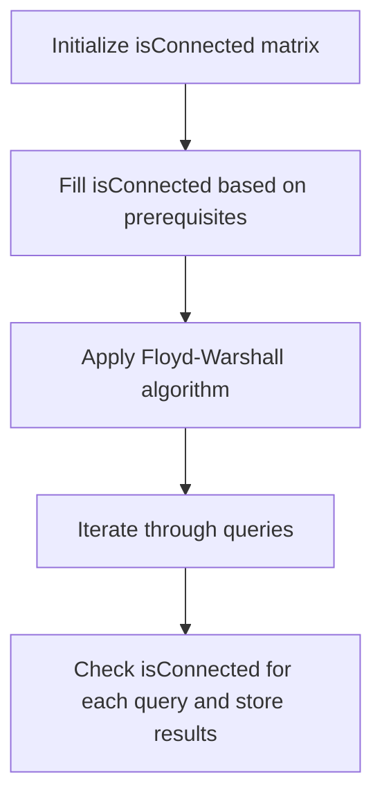

# 1462. Course Schedule IV

## Problem Statement

You are given the integer `n`, which indicates that there are `n` courses labeled from `0` to `n - 1`. You are also given an array `prerequisites` where `prerequisites[i] = [a_i, b_i]` indicates that you must take course `a_i` first if you want to take course `b_i`.

You are also given an array `queries` where `queries[j] = [u_j, v_j]`. For each query `j`, you want to know if course `u_j` is a prerequisite of course `v_j`. Return a boolean array `answer`, where `answer[j]` is the answer to the `j`-th query.

### Example 1
```
Input: n = 2, prerequisites = [[1,0]], queries = [[0,1],[1,0]]
Output: [false,true]
Explanation: The pair [1,0] indicates that to take course 0 you should have taken course 1. So, the answer to the query [0,1] is false, and the answer to the query [1,0] is true.
``` 

### Example 2
```
Input: n = 2, prerequisites = [], queries = [[1,0],[0,1]]
Output: [false,false]
Explanation: There are no prerequisites, and each course is independent. So, the answer to each query is false.
``` 

---

## Approach

To solve this problem, we can use the Floyd-Warshall algorithm to compute the transitive closure of the graph represented by the prerequisites. The transitive closure will allow us to determine if there is a path from course `u` to course `v`, which indicates that `u` is a prerequisite of `v`.

1. We will create a 2D boolean matrix `isConnected` of size `n x n`, where `isConnected[i][j]` will be `true` if course `i` is a prerequisite of course `j`, and `false` otherwise.

2. We will initialize the `isConnected` matrix based on the given `prerequisites`. For each prerequisite pair `[a_i, b_i]`, we will set `isConnected[a_i][b_i]` to `true`.  

3. We will then apply the Floyd-Warshall algorithm to compute the transitive closure of the graph. This involves iterating through each pair of courses `(i, j)` and checking if there is an intermediate course `k` such that `isConnected[i][k]` and `isConnected[k][j]` are both `true`. If so, we will set `isConnected[i][j]` to `true`.

4. Finally, we will iterate through the `queries` and for each query `[u_j, v_j]`, we will check the value of `isConnected[u_j][v_j]` and add it to our result array.



---

## Code Implementation

```cpp
class Solution {
public:
    vector<bool> checkIfPrerequisite(int n, vector<vector<int>>& prerequisites, vector<vector<int>>& queries) {
        vector<vector<bool>> isConnected(n, vector<bool>(n, false));
        for(auto &p: prerequisites){
            int u = p[0]; 
            int v = p[1];
            isConnected[u][v] = true;
        }

        for(int k = 0; k < n; k++){
            for(int i = 0; i < n; i++){
                for(int j = 0; j < n; j++){
                    isConnected[i][j] = isConnected[i][j] ||
                        (isConnected[i][k] && isConnected[k][j]);
                }
            }
        }
        
        vector<bool> result;
        for(auto &q: queries){
            result.push_back(isConnected[q[0]][q[1]]);
        }
        return result;
    }
};
```

---

## Complexity Analysis

- **Time Complexity**: O(n^3 + q), where n is the number of courses and q is the number of queries. The O(n^3) arises from the Floyd-Warshall algorithm used to compute the transitive closure of the graph, and O(q) is for answering the queries.

- **Space Complexity**: O(n^2) for the isConnected matrix that stores the reachability information between courses.

---