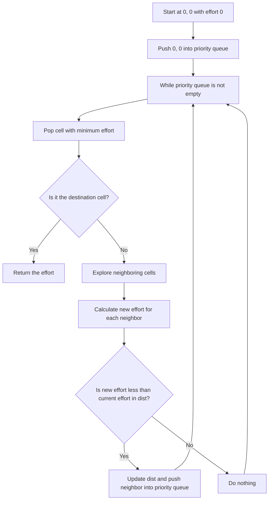

# 1631. Path With Minimum Effort

## Problem Statement

You are a hiker preparing for an upcoming hike. You are given `heights`, a 2D array of size `rows x columns`, where `heights[row][col]` represents the height of cell `(row, col)`. You are situated in the top-left cell, `(0, 0)`, and you hope to travel to the bottom-right cell, `(rows-1, columns-1)` (i.e., 0-indexed). 

You can move **up**, **down**, **left**, or **right**, and you wish to find a route that requires the minimum effort.

A route's effort is the `maximum absolute difference` in heights between two consecutive cells of the route.

Return the `minimum` **effort** required to travel from the top-left cell to the bottom-right cell.

### Example 1:
```
Input: heights = [[1,2,2],[3,8,2],[5,3,5]]
Output: 2
Explanation: The route of [1,3,5,3,5] has a maximum absolute difference of 2 in consecutive cells. This is better than the route of [1,2,2,2,5], where the maximum absolute difference is 3.
```

### Example 2:
```
Input: heights = [[1,2,3],[3,8,4],[5,3,5]]
Output: 1
Explanation: The route of [1,2,3,4,5] has a maximum absolute difference of 1 in consecutive cells, which is better than the route of [1,3,5,3,5], where the maximum absolute difference is 2.
```

### Example 3:
```
Input: heights = [[1,2,1,1,1],[1,2,1,2,1],[1,2,1,2,1],[1,2,1,2,1],[1,1,1,2,1]]
Output: 0
Explanation: This route does not require any effort.
```

---

## Approach

Our task is to find the path with the `minimum effort` in a grid of heights.

Whenever we encounter a problem that asks us to find the `shortest path` or `minimum effort` in a grid, we can think of using `Dijkstra's` algorithm.

In this problem, we can treat each cell in the grid as a node in a graph, and the edges between the nodes will have weights equal to the absolute difference in heights between the two cells.

1. We can use a priority queue (min-heap) to explore the cells in order of their effort. We will start from the top-left cell `(0, 0)` and push it into the priority queue with an initial effort of `0`.

2. We will maintain a distance matrix `dist` where `dist[row][col]` represents the minimum effort required to reach cell `(row, col)` from the starting cell `(0, 0)`. We will initialize all values in `dist` to `INT_MAX` except for the starting cell which will be initialized to `0`.

3. Explore the neighboring cells `(up, down, left, right)` of the current cell. For each neighboring cell, calculate the new effort required to reach that cell from the current cell. 

4. `newEffort` = `max(effort, abs(heights[currentRow][currentCol] - heights[newRow][newCol]))`

5. If `newEffort` is less than the current effort stored in `dist[newRow][newCol]`, update `dist[newRow][newCol]` with `newEffort` and push the neighboring cell into the priority queue with the updated effort.

6. Continue this process until we reach the bottom-right cell `(rows-1, columns-1)`. The effort stored in `dist[rows-1][columns-1]` will be the minimum effort required to reach the destination.



---

## Code Implementation

```cpp
class Solution {
public:
    int minimumEffortPath(vector<vector<int>>& heights) {
        int n = heights.size();
        int m = heights[0].size();
        vector<vector<int>> dist(n, vector<int> (m, INT_MAX));
        priority_queue<pair<int, pair<int, int>>, 
            vector<pair<int, pair<int, int>>>, 
            greater<pair<int, pair<int, int>>>> pq;
        int dirs[5] = {-1, 0, 1, 0, -1};
        
        pq.push({0, {0, 0}});
        dist[0][0] = 0;

        while(!pq.empty()){
            int row = pq.top().second.first;
            int col = pq.top().second.second;
            int effort = pq.top().first;
            pq.pop();
            if(row == n - 1 && col == m - 1) return effort;

            for(int i = 0; i < 4; i++){
                int newR = row + dirs[i];
                int newC = col + dirs[i + 1];
                if(newR >= 0 && newR < n && newC >= 0 && newC < m){
                    int newEffort = max(effort, 
                        abs(heights[row][col] - heights[newR][newC]));
                    
                    if(newEffort < dist[newR][newC]){
                        dist[newR][newC] = newEffort;
                        pq.push({newEffort, {newR, newC}});
                    }
                }
            }
        }
        return 0;
    }
};
```

---

## Complexity Analysis

- **Time Complexity**: O(n * m * log(n * m)), where `n` is the number of rows and `m` is the number of columns in the grid. This is because we are using a priority queue to explore the cells, and in the worst case, we might explore all cells.

- **Space Complexity**: O(n * m) for the distance matrix and the priority queue in the worst case.

---