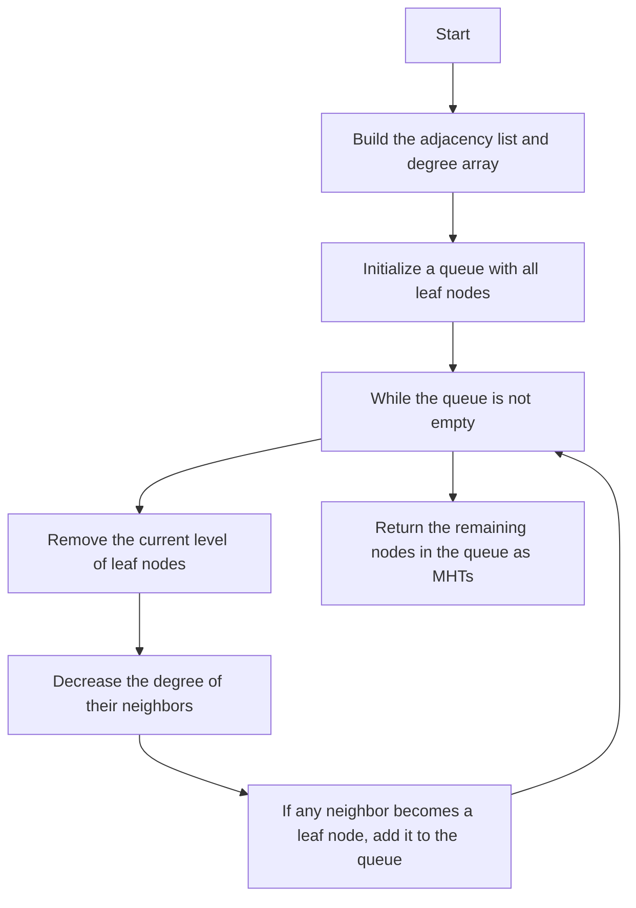

# 310. Minimum Height Trees

## Problem Statement

A tree is an undirected graph in which any two vertices are connected by exactly one path. In other words, any connected graph without simple cycles is a tree.

Given a tree of `n` nodes labelled from `0` to `n - 1`, and an array of `edges` where `edges[i] = [ai, bi]` indicates that there is an undirected edge between the two nodes `ai` and `bi` in the tree, you can choose any node of the tree as the root. When you select a node `x` as the root, the result tree has height `h`. Among all possible rooted trees, those with minimum height (i.e., `min(h)`) are called minimum height trees (MHTs).

Return a list of all `MHTs'` root labels. You can return the answer in any order.

### Example 1:
```
Input: n = 4, edges = [[1,0],[1,2],[1,3]]
Output: [1]
Explanation: As shown, the height of the tree is 1 when the root is the node with label 1 which is the only MHT.
```

### Example 2:
```
Input: n = 6, edges = [[0,3],[1,3],[2,3],[4,3],[5,4]]
Output: [3,4]
Explanation: The height of the tree is 2 when the root is the node with label 3 which is one of the MHTs. The height of the tree is also 2 when the root is the node with label 4 which is the other MHT.
```

---

## Approach

What is the `height` of a tree? The height of a tree is the number of edges on the longest path from the root to a leaf.

How many `MHTs` can a tree have? A tree can have at most 2 MHTs. This is because the longest path in a tree can have at most 2 middle nodes. i.e., if we take the diameter of the tree (the longest path between any two nodes), the MHTs will be the middle node(s) of this diameter. 

Either there will be `one` middle node (if the diameter has an odd number of nodes) or there will be `two` middle nodes (if the diameter has an even number of nodes).

To find the `MHTs`, we can use a topological sort-like approach. We will start with all the leaf nodes (nodes with `degree 1`) and remove them from the tree. After removing the leaf nodes, some of the non-leaf nodes will become leaf nodes. We will repeat this process until we are left with at most 2 nodes. These remaining nodes will be the `MHTs`.




---

## Code Implementation

```cpp
class Solution {
public:
    vector<int> findMinHeightTrees(int n, vector<vector<int>>& edges) {
        if(n == 1) return {0};
        
        vector<vector<int>> adjList(n);
        vector<int> indegrees(n, 0);
        for(auto &edge: edges){
            int u = edge[0];
            int v = edge[1];
            adjList[u].push_back(v);
            adjList[v].push_back(u);
            indegrees[u]++; indegrees[v]++;
        }

        vector<int> mhts;
        queue<int> q;
        for(int i = 0; i < n; i++){
            if(indegrees[i] == 1) q.push(i);
        }

        while(!q.empty()){
            int levelSize = q.size();
            mhts.clear();
            for(int i = 0; i < levelSize; i++){
                int node = q.front(); q.pop();
                mhts.push_back(node);
                for(auto &neighbor: adjList[node]){
                    indegrees[neighbor]--;
                    if(indegrees[neighbor] == 1){
                        q.push(neighbor);
                    }
                }
            }
        }
        return mhts;
    }
};
```

---

## Complexity Analysis

- **Time Complexity**: O(n), where n is the number of nodes in the tree. We visit each node and edge at most once.

- **Space Complexity**: O(n), where n is the number of nodes in the tree. This is due to the adjacency list and the queue used for BFS.

---