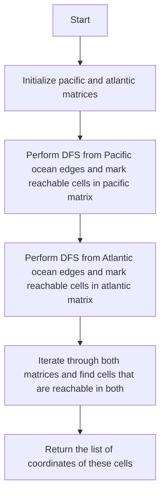

# 417. Pacific Atlantic Water Flow

## Problem Statement

Given an `m x n` matrix of non-negative integers representing the height of each unit cell in a continent, the "Pacific ocean" touches the left and top edges of the matrix and the "Atlantic ocean" touches the right and bottom edges.

Water can only flow in four directions (up, down, left, or right) from a cell to another one with height equal or lower.
Find the list of grid coordinates where water can flow to both the Pacific and Atlantic ocean.

## Example 1

```
Input: heights = [[1,2,2,3,5],[3,2,3,4,4],[2,4,5,3,1],[6,7,1,4,5],[5,1,1,2,4]]
Output: [[0,4],[1,3],[1,4],[2,2],[3,0],[3,1],[4,0]]
```

## Example 2

```
Input: heights = [[2,1],[1,2]]
Output: [[0,0],[0,1],[1,0],[1,1]]
```

---

## Approach

Understand what we have to achieve: We need to find the cells in the grid where water can flow to both the Pacific and Atlantic oceans. We need to check whether it is possible for water to flow from a cell to the Pacific ocean and also to the Atlantic ocean.

To solve this, we will utilize two auxiliary matrices, `pacific` and `atlantic`, of the same size as the input matrix `heights`. The `pacific` matrix will keep track of the cells from which water can flow to the Pacific ocean, and the `atlantic` matrix will keep track of the cells from which water can flow to the Atlantic ocean.

Then we will perform a Depth-First Search (DFS) from the cells adjacent to the Pacific ocean (top and left edges) and mark the reachable cells in the `pacific` matrix. Similarly, we will perform a DFS from the cells adjacent to the Atlantic ocean (bottom and right edges) and mark the reachable cells in the `atlantic` matrix.

Finally, we will iterate through both matrices and find the cells that are marked as reachable in both `pacific` and `atlantic` matrices. These cells will be our answer.



---

## Code Implementation

```cpp
class Solution {
public:
    int n, m;
    void dfs(int i, int j, int prev, vector<vector<int>> &heights, vector<vector<bool>> &ocean){
        if(i < 0 || j < 0 || i >= n || j >= m || ocean[i][j] == true || 
            heights[i][j] < prev) return;

        ocean[i][j] = true;
        dfs(i + 1, j, heights[i][j], heights, ocean);
        dfs(i - 1, j, heights[i][j], heights, ocean);
        dfs(i, j + 1, heights[i][j], heights, ocean);
        dfs(i, j - 1, heights[i][j], heights, ocean);
    }
    
    vector<vector<int>> pacificAtlantic(vector<vector<int>>& heights) {
        this->n = heights.size(), this->m = heights[0].size();
        vector<vector<bool>> pacific(n, vector<bool>(m, false));
        vector<vector<bool>> atlantic(n, vector<bool>(m, false));

        for(int i = 0; i < n; i++){
            dfs(i, 0, heights[i][0], heights, atlantic);
            dfs(i, m - 1, heights[i][m - 1], heights, pacific);
        }

        for(int j = 0; j < m; j++){
            dfs(0, j, heights[0][j], heights, atlantic);
            dfs(n - 1, j, heights[n - 1][j], heights, pacific);
        }

        vector<vector<int>> result;
        for(int i = 0; i < n; i++){
            for(int j = 0; j < m; j++){
                if(pacific[i][j] == true && atlantic[i][j] == true){
                    result.push_back({i, j});
                }
            }
        }
        return result;
    }
};
```

---

## Complexity Analysis

- **Time Complexity**: O(n * m), where n is the number of rows and m is the number of columns in the input matrix. This is because we perform a DFS from each edge cell, and in the worst case, we might visit all cells.

- **Space Complexity**: O(n * m) for the auxiliary matrices `pacific` and `atlantic`, and O(n * m) for the recursion stack in the worst case, leading to an overall space complexity of O(n * m).

---
