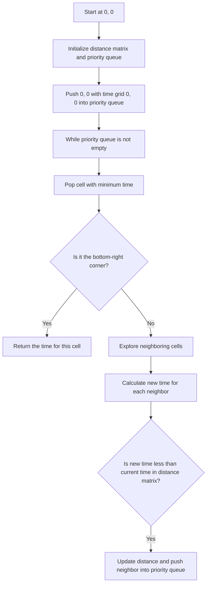

# 778. Swim in Rising Water

## Problem Statement

You are given an `n x n` integer matrix `grid` where each value `grid[i][j]` represents the elevation at that point `(i, j)`.

The rain starts to fall. At time `t`, the depth of the water everywhere is `t`. You can swim from a square to another 4-directionally adjacent square if and only if the elevation of both squares individually are at most `t`. You can swim infinite distances in zero time. Of course, you must stay within the boundaries of the grid during your swim.

Return the least time until you can reach the bottom right square `(n - 1, n - 1)` if you start at the top left square `(0, 0)`.

### Example 1

```
Input: grid = [[0,2],[1,3]]
Output: 3
Explanation:
At time 0, you are in grid location (0, 0). You cannot go anywhere else because 4-directionally adjacent neighbors have a higher elevation than t = 0.
At time 1, you are in grid location (0, 0). You can go to grid location (1, 0) because the elevation of that location (1) is at most t = 1. You cannot go to grid location (0, 1) because the elevation of that location (2) is higher than t = 1.
At time 2, you are in grid location (1, 0). You can go to grid location (1, 1) because the elevation of that location (3) is at most t = 2. You cannot go to grid location (0, 0) because the elevation of that location (0) is at most t = 2.
At time 3, you are in grid location (1, 1). The elevation of that location (3) is at most t = 3. Thus you can reach the bottom right square at time 3.
```

### Example 2

```
Input: grid = [[0,1,2,3,4],[24,23,22,21,5],[12,13,14,15,16],[11,17,18,19,20],[10,9,8,7,6]]
Output: 16
Explanation:
One best path is: (0, 0) -> (0, 1) -> (0, 2) -> (0, 3) -> (0, 4) -> (1, 4) -> (2, 4) -> (3, 4) -> (4, 4)
The time it takes to reach the bottom right square on this path is 16.
```

---

## Approach

We are required to find the `minimum time` required to swim from the top-left corner to the bottom-right corner of a grid, where the water level rises over time.

We can use `Dijkstra's algorithm` to solve this problem as it is a shortest path problem on a grid. 

1. We will maintain a `distance matrix` to keep track of the minimum time required to reach each cell in the grid.

2. We will use a `priority queue` to explore the cells in order of their minimum time.

3. We will start from the top-left corner and explore its neighbors. Push the neighbors into the priority queue with the time it takes to reach them, which is the maximum of the current time and the elevation of the neighbor cell.

4. For each neighbor, `newTime = max(currentTime, grid[newR][newC])`. If `newTime` is less than the previously recorded time for that cell, we update the distance and push it into the priority queue.

5. We will continue this process until we reach the bottom-right corner, at which point the distance matrix will contain the minimum time required to reach that cell.



---

## Code Implementation

```cpp
class Solution {
public:
    int swimInWater(vector<vector<int>>& grid) {
        int n = grid.size();
        int m = grid[0].size();
        vector<vector<int>> dist(n, vector<int> (m, INT_MAX));
        priority_queue<pair<int, pair<int, int>>, 
            vector<pair<int, pair<int, int>>>,
            greater<pair<int, pair<int, int>>>> pq;
        
        dist[0][0] = grid[0][0];
        pq.push({grid[0][0], {0, 0}});
        int dirs[5] = {-1, 0, 1, 0, -1};

        while(!pq.empty()){
            int time = pq.top().first;
            int row = pq.top().second.first;
            int col = pq.top().second.second;
            pq.pop();

            for(int i = 0; i < 4; i++){
                int newR = row + dirs[i];
                int newC = col + dirs[i + 1];

                if(newR >= 0 && newR < n && newC >= 0 && newC < m){
                    int newTime = max(time, grid[newR][newC]);
                    if(newTime < dist[newR][newC]){
                        dist[newR][newC] = newTime;
                        pq.push({newTime, {newR, newC}});
                    }
                }
            }
        }
        return dist[n - 1][m - 1];
    }   
};
```

---

## Complexity Analysis

- **Time Complexity**: O(N^2 log(N^2)) = O(N^2 log N), where N is the size of the grid. This is because we are using a priority queue to process each cell, and there are N^2 cells in the grid.

- **Space Complexity**: O(N^2) for the distance matrix and the priority queue in the worst case.

---