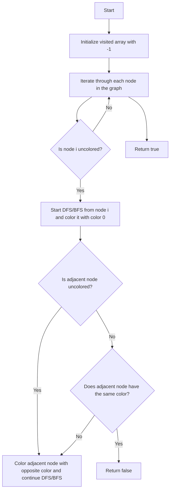

# 785. Is Graph Bipartite?

## Problem Statement

Given an undirected graph, return `true` if and only if it is bipartite.

A graph is `bipartite` if we can split its set of nodes into two independent subsets A and B such that every edge in the graph has one node in A and another node in B. 

### Example 1:
```
Input: graph = [[1,2,3],[0,2],[0,1,3],[0,2]]
Output: false
Explanation: We cannot split the graph into two independent subsets such that every edge has one node in one subset and another node in the other subset.
```

### Example 2:
```
Input: graph = [[1,3],[0,2],[1,3],[0,2]]
Output: true
Explanation: We can split the graph into two independent subsets as follows:
A = {0, 2}, B = {1, 3}
```

---

## Approach

How do we determine if a graph is `bipartite`? We can use a graph coloring technique. We will try to color the graph using two colors (let's say 0 and 1) such that no two adjacent nodes share the same color.

We can use a `Depth-First Search (DFS)` or `Breadth-First Search (BFS)` approach to traverse the graph and color the nodes.

1. We will initialize a visited array `vis` of size `n` (number of nodes) with -1, indicating that no node has been colored yet.

2. We will iterate through each node in the graph. If a node has not been colored (i.e., `vis[i] == -1`), we will start a DFS or BFS from that node and try to color it with color 0.

3. During the DFS or BFS, if we encounter an adjacent node that has not been colored, we will color it with the opposite color (i.e., `1 - color`).

4. If we encounter an adjacent node that has already been colored and it has the same color as the current node, it means the graph cannot be colored with two colors, and hence it is not bipartite. We will return `false` in this case.

5. If we successfully color the graph without any conflicts, we will return `true` at the end.



---

## Code Implementation

```cpp
class Solution {
public:
    bool dfs(int node, int color, vector<int> &vis, vector<vector<int>> &adj){
        vis[node] = color;
        for(auto &neighbour: adj[node]){
            if(vis[neighbour] == -1){
                if(dfs(neighbour, 1 - color, vis, adj) == true){
                    return true;
                }
            }
            else if(vis[neighbour] == color) return true;
        }
        return false;
    }   
    bool isBipartite(vector<vector<int>>& graph) {
        int n = graph.size();
        vector<int> vis(n, -1);

        for(int i = 0; i < n; i++){
            if(vis[i] == -1){
                if(dfs(i, 0, vis, graph) == true){
                    return false;
                }
            }
        }
        return true;
    }
};
```

---

## Complexity Analysis

- **Time Complexity**: O(V + E), where V is the number of vertices and E is the number of edges in the graph. We visit each vertex and edge at most once.

- **Space Complexity**: O(V), where V is the number of vertices in the graph. This is due to the recursion stack and the visited array.

---