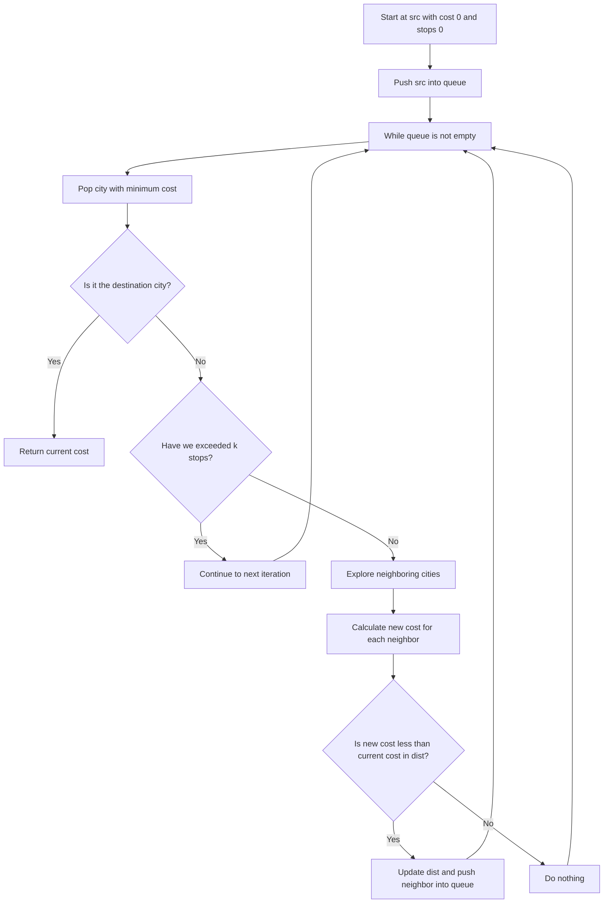

# 787. Cheapest Flights Within K Stops

## Problem Statement

You are given an integer `n`, an array `flights` where `flights[i] = [fromi, toi, pricei]` indicates that there is a flight from city `fromi` to city `toi` with cost `pricei`, and three integers `src`, `dst`, and `k`.

Return the cheapest price from `src` to `dst` with at most `k` stops. If there is no such route, return `-1`.

### Example 1:
```
Input: n = 3, flights = [[0,1,100],[1,2,100],[0,2,500]], src = 0, dst = 2, k = 1
Output: 200
Explanation: The graph is shown above. The cheapest price from city 0 to city 2 with at most 1 stop costs 200, as marked red in the picture.
```

### Example 2:
```
Input: n = 3, flights = [[0,1,100],[1,2,100],[0,2,500]], src = 0, dst = 2, k = 0
Output: 500
Explanation: The graph is shown above. The cheapest price from city 0 to city 2 with at most 0 stops costs 500, as marked blue in the picture.
``` 

---

## Approach

To solve this problem, we can use a modified version of Dijkstra's algorithm or a breadth-first search (BFS) approach. The key difference is that we need to keep track of the `number of stops` made so far, in addition to the `current cost`.

1. We can represent the flights as an `adjacency list`, where each city points to a list of pairs (neighboring city, cost).

2. We can use a `queue` to perform a BFS traversal of the graph. Each element in the queue will be a tuple containing the current cost, the current city, and the number of stops made so far.

3. We will start from the `src` city with an initial cost of `0` and `0` stops. We will push this into the queue.

4. We will maintain a `distance array` to keep track of the minimum cost to reach each city. We will initialize all values in the distance array to `INT_MAX` except for the source city which will be initialized to `0`.

5. We will explore the neighboring cities of the current city. For each neighboring city, we will calculate the new cost to reach that city from the current city.

6. Update `dist[neighbor]` if the `newCost` is less than the current cost stored in `dist[neighbor]`. If we update the cost, we will also push the neighboring city into the queue with the updated cost and incremented stops.

7. We will continue this process until we either reach the destination city or exhaust all possible routes within `k` stops.

**Why we use BFS instead of Dijkstra's?**

- In this problem, we are not just interested in the shortest path but also in the number of stops. 

- `BFS` is more suitable for this problem because it explores all possible routes level by level (i.e., by the number of stops), ensuring that we do not exceed the maximum allowed stops.



---

## Code Implementation

```cpp
class Solution {
public:
    int findCheapestPrice(int n, vector<vector<int>>& flights, int src, int dst, int k) {
        vector<vector<pair<int, int>>> adjList(n);
        for(auto &flight: flights){
            int f = flight[0];
            int t = flight[1];
            int p = flight[2];
            adjList[f].push_back({t, p});
        }

        vector<int> dist(n, INT_MAX);
        queue<tuple<int, int, int>> q;
        q.push({0, src, 0}); // currDist, currNode, stopsSoFar
        dist[src] = 0;

        while(!q.empty()){
            auto [currDist, currNode, stops] = q.front();
            q.pop();

            if(stops > k) break;
            
            for(auto &neigh: adjList[currNode]){
                int neighNode = neigh.first;
                int neighDist = neigh.second;
                int newDist = currDist + neighDist;

                if(newDist < dist[neighNode]){
                    dist[neighNode] = newDist;
                    q.push({newDist, neighNode, stops + 1});
                }
            }
        }

        return dist[dst] == INT_MAX ? -1 : dist[dst];
    }
};
```

---

## Complexity Analysis

- **Time Complexity**: O(E + V log V), where E is the number of flights and V is the number of cities. In the worst case, we may visit all edges and vertices in the graph.

- **Space Complexity**: O(V + E), where V is the number of cities and E is the number of flights. We need space to store the adjacency list and the distance array.

---