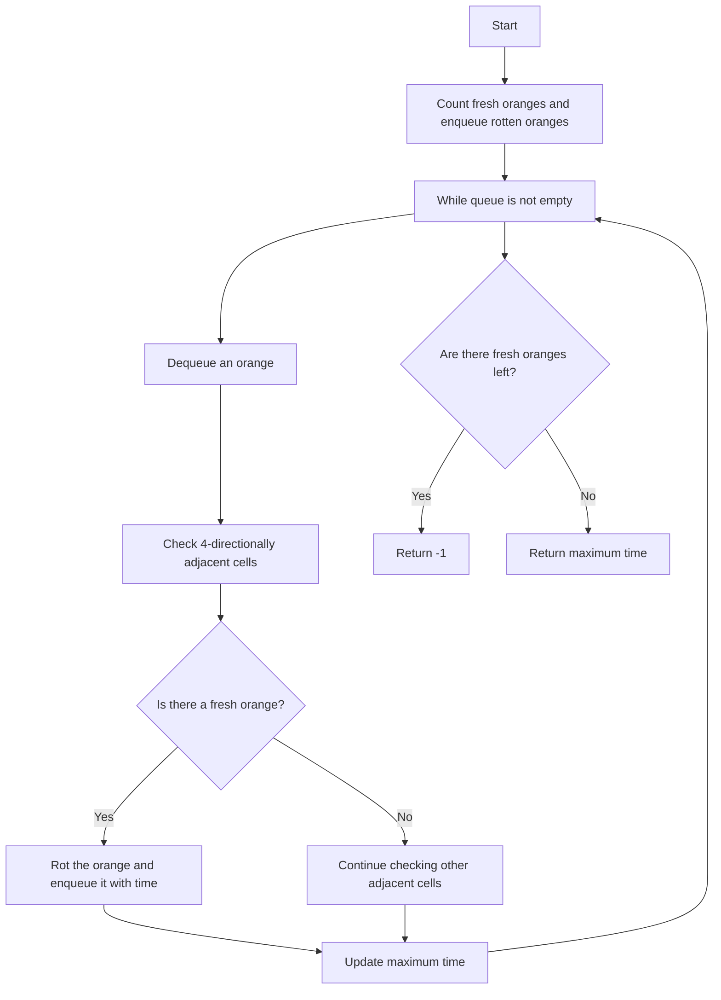

# 994. Rotting Oranges

## Problem Statement

You are given an `m x n` grid where each cell can have one of three values:

- `0` representing an empty cell,

- `1` representing a fresh orange, or

- `2` representing a rotten orange.

Every minute, any fresh orange that is 4-directionally adjacent to a rotten orange becomes rotten. Return the minimum number of minutes that must elapse until no cell has a fresh orange. If this is impossible, return `-1`.

## Example 1

```
Input: grid = [[2,1,1],[1,1,0],[0,1,1]]
Output: 4
```

## Example 2

```
Input: grid = [[2,1,1],[0,1,1],[1,0,1]]
Output: -1
Explanation: The orange in the bottom left corner (row 2, column 0) is never rotten, because rotting only happens 4-directionally.
```

## Example 3

```
Input: grid = [[0,2]]
Output: 0
Explanation: Since there are already no fresh oranges at minute 0, the answer is just 0.
```

---

## Approach

We need to find the minimum time required for all fresh oranges to rot. We can use a `breadth-first search` (BFS) approach to solve this problem.

When the oranges cannot rot anymore, we can check if there are any fresh oranges left. If there are, we return `-1`. Otherwise, we return the time taken for all oranges to rot.

1. We can start by counting the number of fresh oranges and adding the positions of all rotten oranges to a queue.

2. We can then perform a `BFS` on the queue. For each rotten orange, we can check its 4-directionally adjacent cells. If any of those cells contain a fresh orange, we can rot it and add its position to the queue with the time taken to rot it.

3. We can keep track of the maximum time taken to rot all oranges. If there are still fresh oranges left after the `BFS` is complete, we return `-1`. Otherwise, we return the maximum time taken.



---

## Code Implementation

```cpp
class Solution {
public:
    int orangesRotting(vector<vector<int>>& grid) {
        int n = grid.size(), m = grid[0].size();
        int fresh = 0, minTime = 0;
        queue<tuple<int, int, int>> q;

        for(int i = 0; i < n; i++){
            for(int j = 0; j < m; j++){
                if(grid[i][j] == 1){
                    fresh++;
                }
                else if(grid[i][j] == 2){
                    q.push({i, j, 0});
                }
            }
        }

        int dirs[5] = {-1, 0, 1, 0, -1};
        while(!q.empty()){
            auto [row, col, time] = q.front();
            q.pop();

            minTime = max(minTime, time);

            for(int i = 0; i < 4; i++){
                int newR = row + dirs[i];
                int newC = col + dirs[i + 1];

                if(newR >= 0 && newR < n && newC >= 0 && newC < m &&
                    grid[newR][newC] == 1){
                        grid[newR][newC] = 2;
                        fresh--;
                        q.push({newR, newC, time + 1});
                    }
            }
        }
        return (fresh > 0) ? -1 : minTime;
    }
};
```

---

## Complexity Analysis

- **Time Complexity**: O(n * m), where n is the number of rows and m is the number of columns in the grid. We traverse the grid once to count fresh oranges and enqueue rotten oranges, and in the worst case, we might visit each cell again when processing the queue.

- **Space Complexity**: O(n * m) in the worst case, if all oranges are rotten and we enqueue all of them. However, in practice, the space used by the queue will be proportional to the number of rotten oranges at any given time.

---