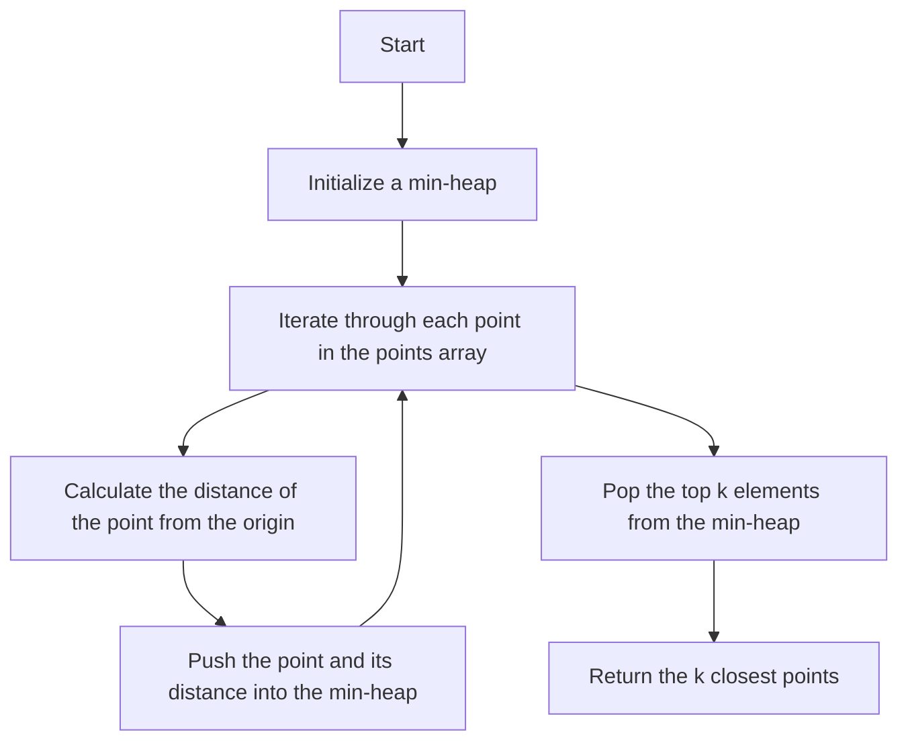

# 973. K Closest Points to Origin

## Problem Statement

Given an array of points where `points[i] = [xi, yi]` represents a point on the X-Y plane and an integer `k`, return the `k` closest points to the origin `(0, 0)`.

### Example 1:
```
Input: points = [[1,3],[-2,2]], k = 1
Output: [[-2,2]]
Explanation:
The distance between (1, 3) and the origin is sqrt(10).
The distance between (-2, 2) and the origin is sqrt(8).
Since sqrt(8) < sqrt(10), (-2, 2) is closer to the origin. We only want the closest k = 1 points from the origin, so the answer is [[-2,2]].
```

### Example 2:
```
Input: points = [[3,3],[5,-1],[-2,4]], k = 2
Output: [[3,3],[-2,4]]
Explanation: The answer [[-2,4],[3,3]] would also be accepted.  
```

---

## Approach

To solve this problem, we can use a `min-heap` (or priority queue) to keep track of the closest points to the origin.

1. We will iterate through the list of points and calculate the distance of each point from the origin using the formula `distance = sqrt(x^2 + y^2)`. However, since we only need to compare distances, we can use `distance^2 = x^2 + y^2` to avoid unnecessary square root calculations.

2. We will push each point along with its distance from the origin into the min-heap. The min-heap will automatically keep the points sorted based on their distance from the origin.

3. After processing all points, we will pop the top `k` elements from the min-heap, which will be the `k` closest points to the origin.



---

## Code Implementation

```cpp
class Solution {
public:
    vector<vector<int>> kClosest(vector<vector<int>>& points, int k) {
        priority_queue<pair<int, pair<int, int>>, vector<pair<int, pair<int, int>>>,
            greater<pair<int, pair<int, int>>>> pq;
        for(auto &point: points){
            int x = point[0], y = point[1];
            int dist = (x * x) + (y * y);
            pq.push({dist, {x, y}});
        }

        vector<vector<int>> result;
        while(k--){
            auto[dist, elems] = pq.top(); pq.pop();
            result.push_back({elems.first, elems.second});
        }
        return result;
    }
}; 
```

---

## Complexity Analysis

- **Time Complexity**: O(n log n) where n is the number of points. This is because we are inserting all points into a priority queue which takes O(log n) time for each insertion.

- **Space Complexity**: O(n) for the priority queue that stores all the points and their distances. The result vector takes O(k) space, but since k <= n, we can consider it as O(n) in the worst case.

---