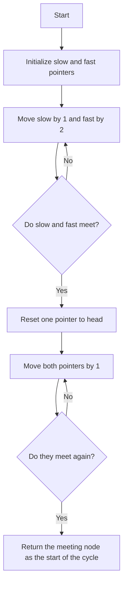

# 142. Linked List Cycle II

## Problem Statement

Given the `head` of a linked list, return the node where the cycle begins. If there is no cycle, return `null`.

### Example 1:
```
Input: head = [3,2,0,-4], pos = 1
Output: tail connects to node index 1
Explanation: There is a cycle in the linked list, where tail connects to the second node.
```

### Example 2:
```
Input: head = [1,2], pos = 0
Output: tail connects to node index 0
Explanation: There is a cycle in the linked list, where tail connects to the first node.
```

---

## Approach

To solve this problem, we can use the `Floyd's Tortoise and Hare` algorithm, which is a common technique for detecting cycles in linked lists.

1. We will use two pointers, `slow` and `fast`. The `slow` pointer will move one step at a time, while the `fast` pointer will move two steps at a time.

2. We will move the pointers through the linked list until they meet. If there is no cycle, the `fast` pointer will reach the end of the list.

3. Once the `slow` and `fast` pointers meet, we will reset one of the pointers to the head of the linked list and keep the other pointer at the meeting point.

4. We will then move both pointers one step at a time until they meet again. The point at which they meet will be the node where the cycle begins.




---

## Code Implementation

```java
public class Solution {
    public ListNode detectCycle(ListNode head) {
        if(head == null || head.next == null) return null;
        
        ListNode slow = head, fast = head;
        while(fast != null && fast.next != null){
            slow = slow.next;
            fast = fast.next.next;
            if(slow == fast) break;
        }

        if(slow == fast){
            slow = head;
            while(slow != fast){
                slow = slow.next;
                fast = fast.next;
            }
            return slow;
        }

        return null;
    }
}
```

---

## Complexity Analysis

- **Time Complexity**: `O(n)`, where `n` is the number of nodes in the linked list. In the worst case, we traverse the linked list twice: once to find the meeting point of the slow and fast pointers, and once to find the entry point of the cycle.

- **Space Complexity**: `O(1)`, as we are using only a constant amount of extra space for the slow and fast pointers.

---