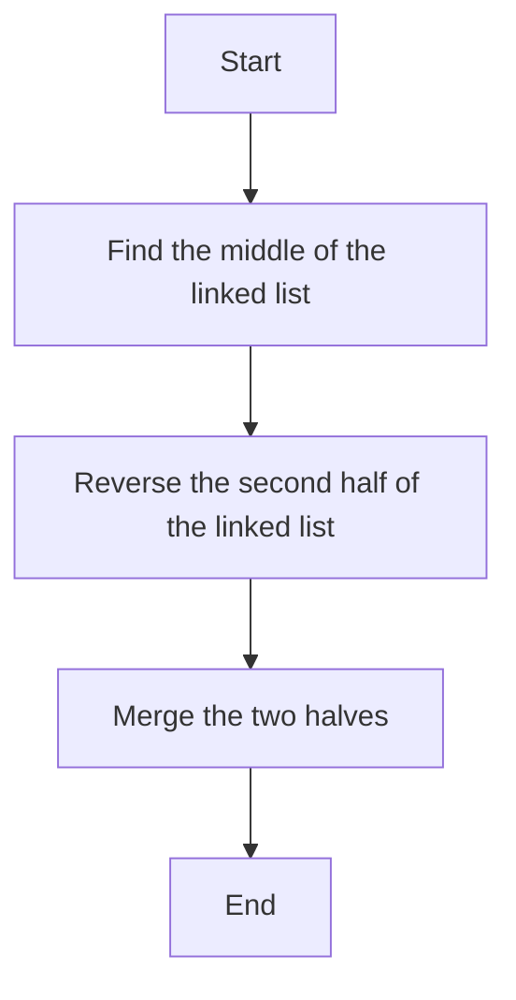

# 143. Reorder List

## Problem Statement

Given the head of a singly linked list, reorder the list to be in the following form:

```L0 → Ln → L1 → Ln - 1 → L2 → Ln - 2 → ...```

The reordering should be done in-place without altering the nodes' values.

### Example 1:
```
Input: head = [1,2,3,4]
Output: [1,4,2,3]
```

### Example 2:
```
Input: head = [1,2,3,4,5]
Output: [1,5,2,4,3]
```
---

## Approach

To reorder the linked list in the required pattern, we can follow these steps:

1. **Find the middle of the linked list**: We can use the fast and slow pointer technique to find the middle node of the linked list. The slow pointer will move one step at a time, while the fast pointer will move two steps at a time. When the fast pointer reaches the end of the list, the slow pointer will be at the middle.

2. **Reverse the second half of the linked list**: Once we have the middle node, we can reverse the second half of the linked list starting from the node next to the middle node.

3. **Merge the two halves**: After reversing the second half, we will have two separate linked lists. We can then merge these two linked lists together in the required order.




---

## Code Implementation

```java
class Solution {
    private ListNode findMiddle(ListNode head){
        ListNode slow = head;
        ListNode fast = head;
        while(fast != null && fast.next != null){
            slow = slow.next;
            fast = fast.next.next;
        }
        return slow;
    }

    private ListNode reverseNodes(ListNode head){
        ListNode temp = head;
        ListNode prev = null, front = null;
        while(temp != null){
            front = temp.next;
            temp.next = prev;
            prev = temp;
            temp = front;
        }
        return prev;
    }

    public void reorderList(ListNode head) {
        ListNode midNode = findMiddle(head);
        ListNode midNodeNext = midNode.next;
        midNode.next = null;

        ListNode first = head;
        ListNode second = reverseNodes(midNodeNext);

        while(second != null){
            ListNode firstNodeNext = first.next;
            ListNode secondNodeNext = second.next;

            first.next = second;
            second.next = firstNodeNext;

            first = firstNodeNext;
            second = secondNodeNext;
        }        
    }
}
```

---

## Complexity Analysis

- **Time Complexity**: `O(n)`, where `n` is the number of nodes in the linked list. We traverse the linked list a few times (to find the middle, reverse the second half, and merge the two halves), but each traversal takes linear time.

- **Space Complexity**: `O(1)`, since we are reordering the list in-place and not using any additional data structures that grow with the input size.

---