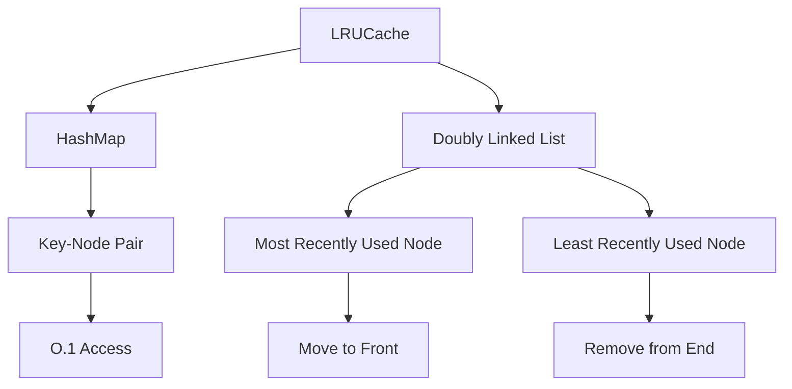

# 146. LRU Cache

## Problem Statement

Design a data structure that follows the constraints of a `Least Recently Used (LRU) cache`. Implement the `LRUCache` class:

- `LRUCache(int capacity)` Initialize the LRU cache with positive size `capacity`.

- `int get(int key)` Return the value of the `key` if the `key` exists, otherwise return `-1`.

- `void put(int key, int value)` Update the value of the `key` if the `key` exists. Otherwise, add the `key-value` pair to the cache. If the number of keys exceeds the `capacity` from this operation, evict the least recently used key.

### Example 1:
```
Input
["LRUCache", "put", "put", "get", "put", "get", "put", "get", "get", "get"]
[[2], [1, 1], [2, 2], [1], [3, 3], [2], [4, 4], [1], [3], [4]]
Output
[null, null, null, 1, null, -1, null, -1, 3, 4]
```
---

## Approach

To implement the `LRUCache`, we can use a combination of a `HashMap` and a `Doubly Linked List`.

- The `HashMap` will store the key and a reference to the corresponding node in the doubly linked list. This allows for O(1) access time for both `get` and `put` operations.

- The `Doubly Linked List` will maintain the order of usage of the keys. The most recently used key will be at the front of the list, and the least recently used key will be at the end of the list. This allows for O(1) time complexity for both insertion and deletion operations.

When we perform a `get` operation, we will check if the key exists in the `HashMap`. If it does, we will move the corresponding node to the front of the doubly linked list to mark it as the most recently used. If it does not exist, we will return `-1`.

When we perform a `put` operation, we will first check if the key already exists in the `HashMap`. If it does, we will update the value and move the corresponding node to the front of the doubly linked list. If it does not exist, we will create a new node and insert it at the front of the doubly linked list. If the cache exceeds its capacity, we will remove the least recently used node from both the doubly linked list and the `HashMap`.




---

## Code Implementation

```java

class Node{
    int key, value;
    Node prev;
    Node next;
    Node(int key, int value){
        this.key = key;
        this.value = value;
    }
}

class LRUCache {
    private final int capacity;
    private final Map<Integer, Node> mpp;
    private final Node head, tail;

    public LRUCache(int capacity) {
        this.capacity = capacity;
        this.mpp = new HashMap<>();
        this.head = new Node(0, 0);
        this.tail = new Node(0, 0);
        head.next = tail;
        tail.prev = head;
    }
    
    public int get(int key) {
        if(!mpp.containsKey(key)) return -1;
        Node node = mpp.get(key);
        remove(node);
        insertAtFront(node);
        return node.value;
    }
    
    public void put(int key, int value) {
        if(mpp.containsKey(key)){
            Node node = mpp.get(key);
            node.value = value;
            remove(node);
            insertAtFront(node);
        }
        else{
            if(mpp.size() == capacity){
                Node node = tail.prev;
                remove(node);
                mpp.remove(node.key);
            }
            Node newNode = new Node(key, value);
            insertAtFront(newNode);
            mpp.put(key, newNode);
        }
    }

    private void insertAtFront(Node node){
        node.next = head.next;
        node.prev = head;
        head.next.prev = node;
        head.next = node;
    }

    private void remove(Node node){
        node.next.prev = node.prev;
        node.prev.next = node.next;
    }
}
```

---

## Complexity Analysis

- **Time Complexity**: O(1) for both `get` and `put` operations. This is because we are using a HashMap to store the nodes, which allows for O(1) access time, and the operations on the doubly linked list (insertion and removal) also take O(1) time.

- **Space Complexity**: O(capacity) for the HashMap and the doubly linked list, as we are storing at most `capacity` number of nodes in both data structures.

---