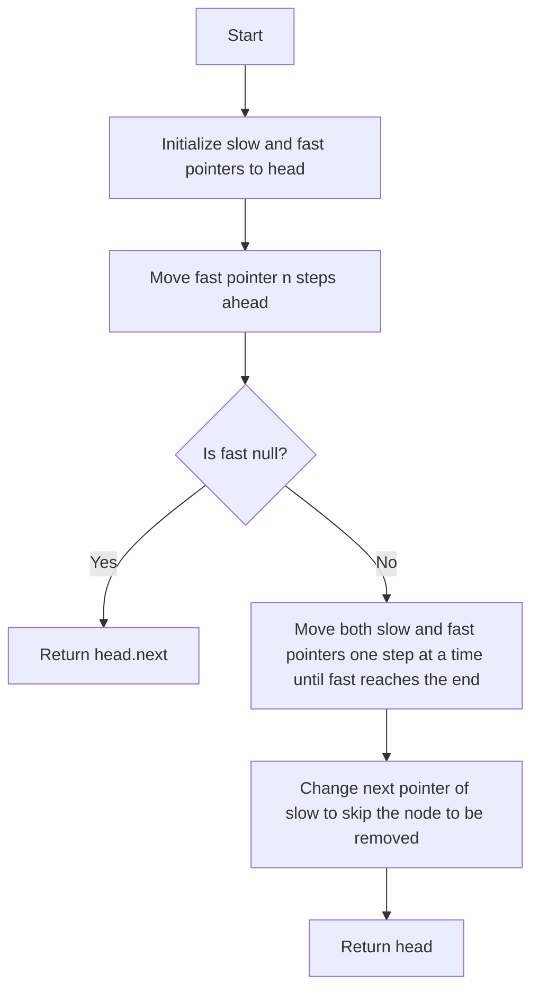

# 19. Remove Nth Node From End of List

## Problem Statement

Given the head of a linked list, remove the nth node from the end of the list and return its head.

### Example 1:
```
Input: head = [1,2,3,4,5], n = 2
Output: [1,2,3,5]
```

### Example 2:
```
Input: head = [1], n = 1
Output: []
```

### Example 3:
```
Input: head = [1,2], n = 1
Output: [1]
```

---

## Approach

To remove the nth node from the end of the linked list, we can use the two-pointer technique. We will maintain two pointers, `slow` and `fast`, which will traverse the linked list.

1. We will first move the `fast` pointer `n` steps ahead in the linked list. This will create a gap of `n` nodes between the `slow` and `fast` pointers.

2. If the `fast` pointer becomes `null` after moving `n` steps, it means we need to remove the head of the linked list. In this case, we can simply return `head.next`.

3. If the `fast` pointer is not `null`, we will move both `slow` and `fast` pointers one step at a time until the `fast` pointer reaches the end of the linked list. At this point, the `slow` pointer will be pointing to the node just before the node we want to remove.

4. We can then remove the nth node from the end by changing the `next` pointer of the `slow` node to skip the node we want to remove.



---

## Code Implementation

```java
class Solution {
    public ListNode removeNthFromEnd(ListNode head, int n) {
        ListNode slow = head;
        ListNode fast = head;

        for(int i = 0; i < n; i++){
            fast = fast.next;
        }
        if(fast == null) return head.next;

        while(fast.next != null){
            slow = slow.next;
            fast = fast.next;
        }
        slow.next = slow.next.next;
        return head;
    }
}
```

---

## Complexity Analysis

- **Time Complexity**: O(L), where L is the length of the linked list. We traverse the list at most twice (once to find the nth node and once to remove it).

- **Space Complexity**: O(1), as we are using only a constant amount of extra space for the two pointers.

---