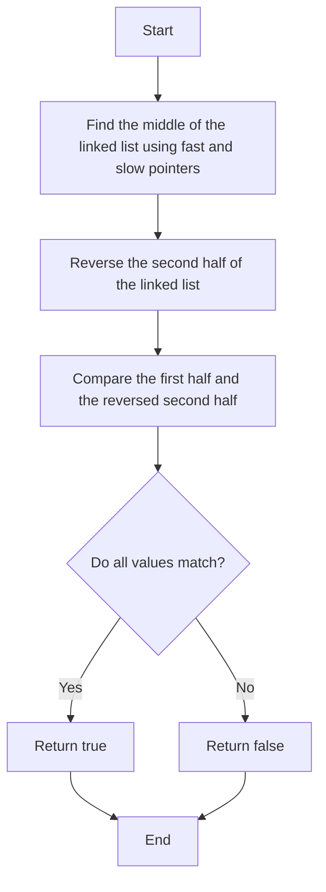

# 234. Palindrome Linked List

## Problem Statement

Given the head of a singly linked list, return `true` if it is a palindrome or `false` otherwise.

### Example 1:
```
Input: head = [1,2,2,1]
Output: true
```

### Example 2:
```
Input: head = [1,2]
Output: false
```

---

## Approach

To determine if a linked list is a palindrome, we can use the following approach:

1. **Find the middle of the linked list**: We can use the fast and slow pointer technique to find the middle of the linked list. 

2. **Reverse the second half of the linked list**: Once we find the middle, we can reverse the second half of the linked list. This will allow us to compare the first half and the reversed second half easily.

3. **Compare the two halves**: We can then compare the values of the nodes in the first half and the reversed second half. If all values match, then the linked list is a palindrome.

4. **Restore the original linked list (optional)**: If we want to restore the original linked list, we can reverse the second half again and attach it back to the first half.




---

## Code Implementation

```java

class Solution {
    private ListNode reverseLL(ListNode head){
        if(head == null || head.next == null) return head;
        ListNode temp = head;
        ListNode prev = null;
        ListNode front = null;

        while(temp != null){
            front = temp.next;
            temp.next = prev;
            prev = temp;
            temp = front;
        }
        return prev;
    }

    public boolean isPalindrome(ListNode head) {
        if(head == null || head.next == null) return true;
        ListNode slow = head;
        ListNode fast = head;

        while(fast.next != null && fast.next.next != null){
            slow = slow.next;
            fast = fast.next.next;
        }

        ListNode newHead = reverseLL(slow.next);
        ListNode firstPart = head;
        ListNode secondPart = newHead;

        while(secondPart != null){
            if(firstPart.val != secondPart.val){
                return false;
            }
            firstPart = firstPart.next;
            secondPart = secondPart.next;
        }
        return true;
    }
}
```

---

## Complexity Analysis

- **Time Complexity**: O(n), where n is the number of nodes in the linked list. We traverse the linked list a few times (to find the middle, reverse the second half, and compare both halves), but each traversal takes O(n) time.

- **Space Complexity**: O(1), since we are reversing the linked list in place and not using any additional data structures that grow with the input size.

---