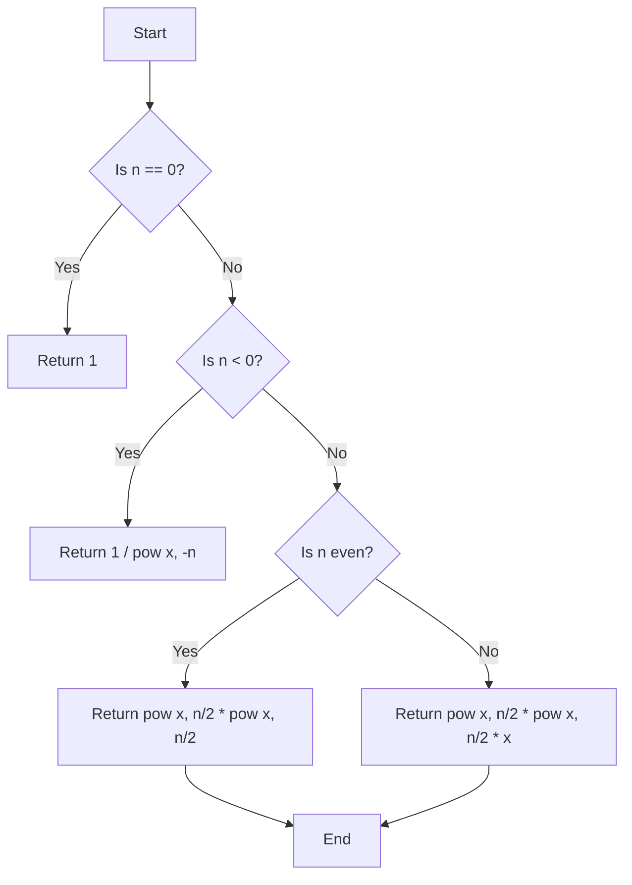

# 50. Pow(x, n)

## Problem Statement

Implement the function `pow(x, n)` that calculates x raised to the power n (i.e., x^n).

### Example 1:

```
Input: x = 2.00000, n = 10
Output: 1024.00000
```

### Example 2:

```
Input: x = 2.10000, n = 3
Output: 9.26100
```

### Example 3:

```
Input: x = 2.00000, n = -2
Output: 0.25000
Explanation: 2^-2 = 1/(2^2) = 1/4
```

---

## Approach

Let's understand the mathematical intuition of `pow(x, n)`.

- If `n` is 0, then `x^0` is always 1.

- If `n` is negative, then `x^n` can be expressed as `1/(x^-n)`. For example, `2^-2` can be expressed as `1/(2^2)`.

- If `n` is positive, we can use the property of exponents to break down the problem. For example, `x^n` can be expressed as `(x^(n/2)) * (x^(n/2))` if `n` is even, and as `(x^(n/2)) * (x^(n/2)) * x` if `n` is odd.

Using this approach, we can recursively calculate `pow(x, n)` by dividing the exponent `n` by 2 in each recursive call, which leads to a logarithmic time complexity.




---

## Code Implementation

```java
class Solution {
    private double pow(double x, long n){
        if(n == 0) return 1;
        double res = pow(x, n / 2);

        if(n % 2 == 0) return res * res;
        else return res * res * x;        
    }

    public double myPow(double x, int n) {
        if(n == 0) return 1;
        
        long N = (long)n;
        if(n > 0){
            return pow(x, N);
        }
        else{
            return pow(1 / x, Math.abs(N));
        }
    }
}
```
---

## Complexity Analysis

- **Time Complexity**: O(log n), where `n` is the exponent. This is because we are dividing the exponent by 2 in each recursive call, leading to a logarithmic number of calls.

- **Space Complexity**: O(log n) due to the recursion stack. Each recursive call adds a new layer to the stack, and since we are dividing `n` by 2 each time, the maximum depth of the recursion will be log(n).

---