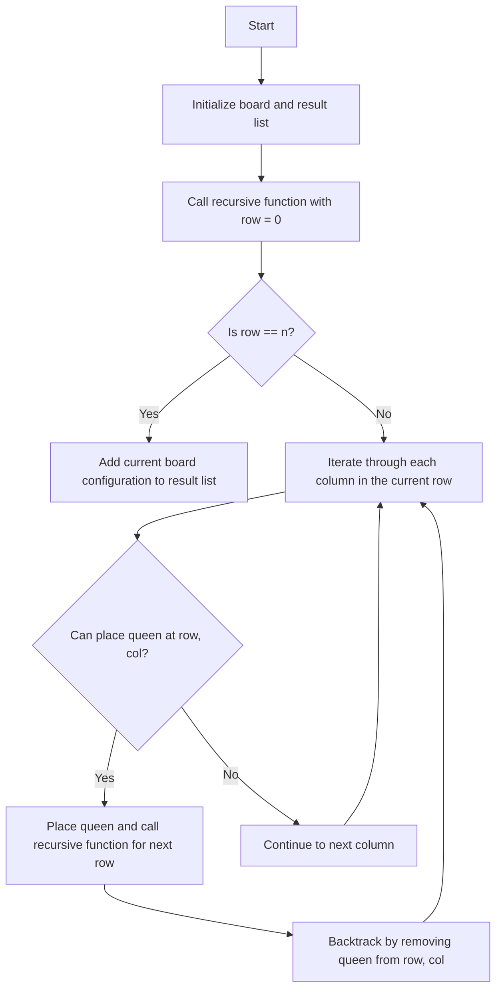

# 51. N-Queens

## Problem Statement

The **n-queens puzzle** is the problem of placing `n` queens on an `n x n` chessboard such that no two queens attack each other.

Given an integer `n`, return all distinct solutions to the n-queens puzzle. You may return the answer in any order.

Each solution contains a distinct board configuration of the n-queens' placement, where `'Q'` and `'.'` both indicate a queen and an empty space, respectively.


### Example 1:

```
Input: n = 4
Output: [[".Q..","...Q","Q...","..Q."],["..Q.","Q...","...Q",".Q.."]]
Explanation: There exist two distinct solutions to the 4-queens puzzle as shown above.
``` 

### Example 2:

```
Input: n = 1
Output: [["Q"]]
```
---

## Approach

The `N-Queens` problem can be solved using a backtracking approach. The idea is to place queens one by one in different columns, starting from the leftmost column to the rightmost column, having only 1 queen in each column and row. 

`Conditions` to check if a queen can be placed in a given position are:

- The **queen** should not be in the same row as any other queen.
- The **queen** should not be in the same column as any other queen.
- The **queen** should not be in the same diagonal as any other queen.

Keeping this in mind, we can use a recursive function to place queens on the board and backtrack when we reach a dead end.

1. Create a 2D array to represent the chessboard and initialize it with `'.'`.

2. Create a recursive function that takes the current row and column as parameters.

3. In the recursive function, check if the current row is equal to `n`. If it is, it means we have successfully placed all queens on the board, so we can add the current board configuration to the result list.

4. If the current row is not equal to `n`, iterate through each column in the current row and check if a queen can be placed in that position using the conditions mentioned above.

5. If a queen can be placed, place the queen on the board and call the recursive function for the next row.

6. After returning from the recursive call, remove the queen from the current position (backtrack) and continue checking for other columns in the current row.

7. Repeat steps 4-6 until all columns in the current row have been checked.




---

## Code Implementation

```java
class Solution {
    List<List<String>> res;
    
    private boolean canPlaceQueens(int row, int col, int n, char[][] board){
        int tempRow = row, tempCol = col;
        while(tempRow >= 0 && tempCol >= 0){
            if(board[tempRow][tempCol] == 'Q') return false;
            tempRow--;
            tempCol--;
        }

        tempRow = row; tempCol = col;
        while(tempRow >= 0 && tempCol < n){
            if(board[tempRow][tempCol] == 'Q') return false;
            tempRow--;
            tempCol++;
        }

        tempRow = row; tempCol = col;
        while(tempRow >= 0){
            if(board[tempRow][tempCol] == 'Q') return false;
            tempRow--;
        }
        return true;
    }

    private void backtrack(int row, int col, int n, char[][] board){
        if(row == n){
            List<String> list = new ArrayList<>();
            for(int i = 0; i < n; i++){
                list.add(new String(board[i]));
            }
            this.res.add(list);
            return;
        }

        for(int c = col; c < n; c++){
            if(canPlaceQueens(row, c, n, board)){
                board[row][c] = 'Q';
                backtrack(row + 1, col, n, board);
                board[row][c] = '.';
            }
        }
    }

    public List<List<String>> solveNQueens(int n) {
        this.res = new ArrayList<>();
        char[][] board = new char[n][n];
        for(int i = 0; i < n; i++) Arrays.fill(board[i], '.');
        
        backtrack(0, 0, n, board);
        return this.res;
    }
}
```

---

## Complexity Analysis

- **Time Complexity**: O(N!), where N is the number of queens. The time complexity arises because we are trying to place queens in each row, and for each row, we have N choices for columns. However, due to the constraints of the problem (no two queens can be in the same row or column), the number of valid placements reduces significantly as we progress through the rows.

- **Space Complexity**: O(N^2) for the board and O(N) for the recursion stack. The board takes up space proportional to N^2, and the recursion stack can go as deep as N in the worst case.


---