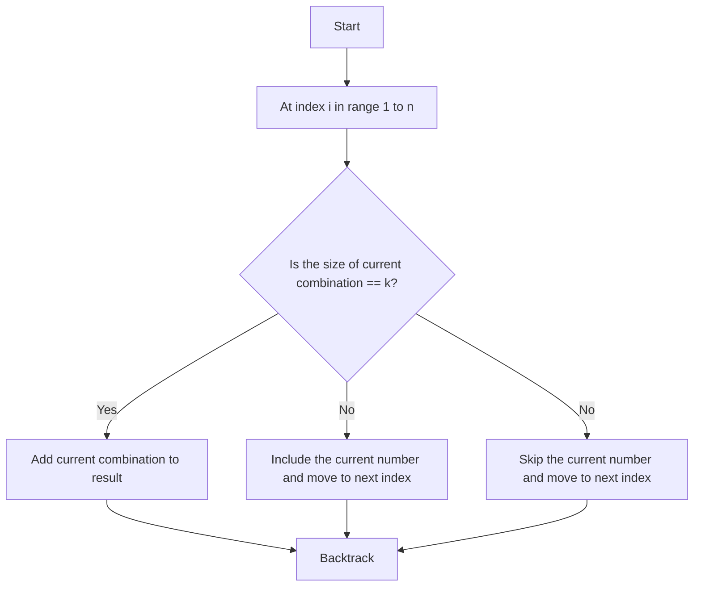

# 77. Combinations

## Problem Statement

Given two integers `n` and `k`, return all possible combinations of `k` numbers out of the range `[1, n]`.

### Example 1:
```
Input: n = 4, k = 2
Output: [[2,4],[3,4],[2,3],[1,2],[1,3],[1,4]]
```

### Example 2:
```
Input: n = 1, k = 1
Output: [[1]]
```

---

## Approach

To find the combinations of `k` numbers from the range `[1, n]`, we can use a backtracking approach.

```text
C(n, k) = C(n-1, k-1) + C(n-1, k), this is because we can either include the current number in our combination or exclude it.
```

1. **Backtracking**: We will use a backtracking approach to generate all possible combinations. We maintain a current combination and explore all possible choices at each step.

2. Initially, we start with an empty combination and iterate through the range `[1, n]`. For each number, we can either include it in the current combination or skip it. If we include it, we move to the next index.

3. **Base Case**: When the size of the current combination reaches `k`, we add the current combination to the result list.




---

## Code Implementation

```java
class Solution {
    List<List<Integer>> res;
    
    private void backtrack(int index, int n, int k, List<Integer> curr){
        if(curr.size() == k){            
            res.add(new ArrayList<>(curr));
            return;
        }

        for(int i = index; i < n; i++){
            curr.add(i + 1);
            backtrack(i + 1, n, k, curr);
            curr.remove(curr.size() - 1);
        }
    }

    public List<List<Integer>> combine(int n, int k) {
        this.res = new ArrayList<>();
        List<Integer> curr = new ArrayList<>();
        backtrack(0, n, k, curr);
        return this.res;
    }
}
```

---

## Complexity Analysis

- **Time Complexity**: O(C(n, k) * k), where C(n, k) is the number of combinations of n items taken k at a time. This is because we are generating all possible combinations and each combination takes O(k) time to construct.

- **Space Complexity**: O(k), where k is the maximum depth of the recursion stack. This is because we are using a recursive approach and the maximum depth of the recursion tree will be k.

---