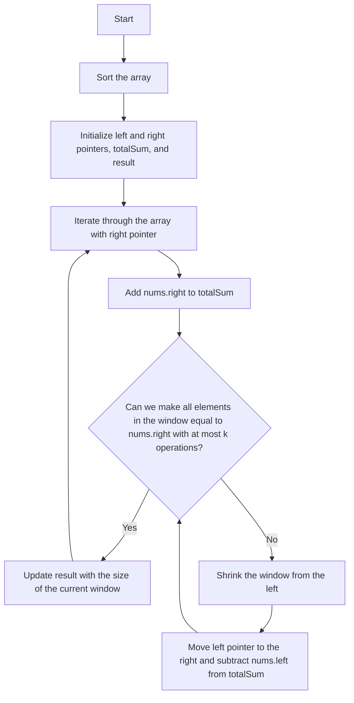

# 1838. Frequency of the Most Frequent Element

## Problem Statement

You are given an array of integers `nums` and an integer `k`. In one operation, you can choose an index of `nums` and increment the element at that index by `1`.

Return the maximum possible frequency of an element after performing at most `k` operations.

## Example 1

```
Input: nums = [1,2,4], k = 5
Output: 3
Explanation: Increment the first element three times and the second element two times to make nums = [4,4,4]. 4 has a frequency of 3.
```

## Example 2

```
Input: nums = [1,4,8,13], k = 5
Output: 2
Explanation: There are multiple optimal solutions: increment the first element three times and the second element two times to make nums = [4,4,8,13], or increment the second element four times and the third element once to make nums = [1,8,8,13], or increment the third element five times to make nums = [1,4,13,13]. Both 4 and 8 have a frequency of 2.
``` 

## Example 3

```
Input: nums = [3,9,6], k = 2
Output: 1
```
---

## Approach

We have to find the maximum frequency of an element in the array after performing at most `k` increment operations.

Suppose we have an array `{1,2,4}` and `k = 5`. We can increment the first element three times and the second element two times to make the array `[4,4,4]`. The frequency of `4` is `3`, which is the maximum frequency we can achieve with at most `5` operations.

To solve this problem, we can use the two-pointer technique along with sorting.

1. First, we sort the array `nums` in non-decreasing order.

2. We initialize two pointers, `left` and `right`, to the beginning of the array. We also initialize a variable `totalSum` to keep track of the sum of the elements in the current window defined by the two pointers, and a variable `result` to keep track of the maximum frequency found.

3. We iterate through the array using the `right` pointer. For each element at index `right`, we add it to `totalSum`.

4. We then check if the current window defined by `left` and `right` can be made to have all elements equal to `nums[right]` using at most `k` operations. 

    - The total number of operations needed to make all elements in the current window equal to `nums[right]` is given by the formula: `nums[right] * (right - left + 1) - totalSum`. This is because we want to make all elements in the window equal to `nums[right]`, and we need to add the difference between `nums[right]` and each element in the window.

5. If the number of operations needed is greater than `k`, we need to shrink the window from the left by moving the `left` pointer to the right and subtracting the element at `left` from `totalSum`.

6. We update the `result` with the maximum frequency found, which is the size of the current window defined by `left` and `right`.




---

## Code Implementation

```cpp
class Solution {
public:
    int maxFrequency(vector<int>& nums, int k) {
        int n = nums.size();
        int left = 0, right = 0;
        long totalSum = 0, result = 0;
        sort(nums.begin(), nums.end());
        
        while(right < n){
            totalSum += nums[right];
            while(nums[right] * (long)(right - left + 1) > totalSum + k){
                totalSum -= nums[left];
                left++;
            }
            result = max(result, (long)(right - left + 1));
            right++;
        }
        return result;
    }
};
```

---

## Complexity Analysis

- **Time Complexity**: O(n log n) due to the sorting step, where n is the length of the input array `nums`. The two-pointer traversal takes O(n) time.

- **Space Complexity**: O(1) if we ignore the space used for sorting, otherwise O(n) due to the sorting step.

---