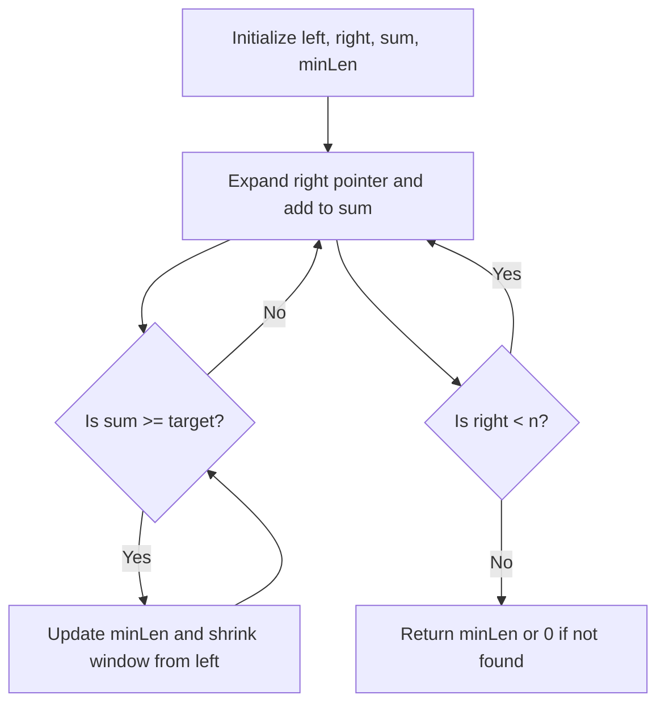

# 209. Minimum Size Subarray Sum

## Problem Statement

Given an array of positive integers `nums` and a positive integer `target`, return the minimal length of a contiguous subarray of which the sum is greater than or equal to `target`. If there is no such subarray, return 0 instead.

### Example 1

```
Input: target = 7, nums = [2,3,1,2,4,3]
Output: 2
Explanation: The subarray [4,3] has the minimal length under the problem constraint.
```

### Example 2

```
Input: target = 4, nums = [1,4,4]
Output: 1
```

### Example 3

```
Input: target = 11, nums = [1,1,1,1,1,1,1,1]
Output: 0
```

---


## Approach

We have to find the `minLen` of a contiguous subarray such that the sum of its elements is greater than or equal to `target`. We can use the `sliding window` technique to solve this problem efficiently.

1. Initialize two pointers `left` and `right` to the start of the array, a variable `sum` to keep track of the current sum of the window, and `minLen` to store the minimum length found.

2. Expand the `right` pointer to include elements in the window and add their values to `sum` until `sum` is greater than or equal to `target`.

3. Once `sum` is greater than or equal to `target`, we can try to shrink the window from the left by moving the `left` pointer to the right and subtracting the values from `sum`. We also update `minLen` with the current window size if it's smaller than the previously recorded minimum length.

4. Repeat steps 2 and 3 until the `right` pointer reaches the end of the array.



---

## Code Implementation

```cpp
class Solution {
public:
    int minSubArrayLen(int target, vector<int>& nums) {
        int n = nums.size();
        int sum = 0;
        int left = 0, right = 0, minLen = INT_MAX;
        
        while(right < n){
            sum += nums[right];
            while(sum >= target){
                minLen = min(minLen, right - left + 1);
                sum -= nums[left];
                left++;
            }
            right++;
        }
        
        return (minLen == INT_MAX) ? 0 : minLen;
    }
};
```

---

## Complexity Analysis

- **Time Complexity**: O(n), where n is the number of elements in the input array `nums`. Each element is visited at most twice (once when added to the sum and once when removed from the sum).

- **Space Complexity**: O(1), as we are using only a constant amount of extra space to store the sum, pointers, and minimum length.

---