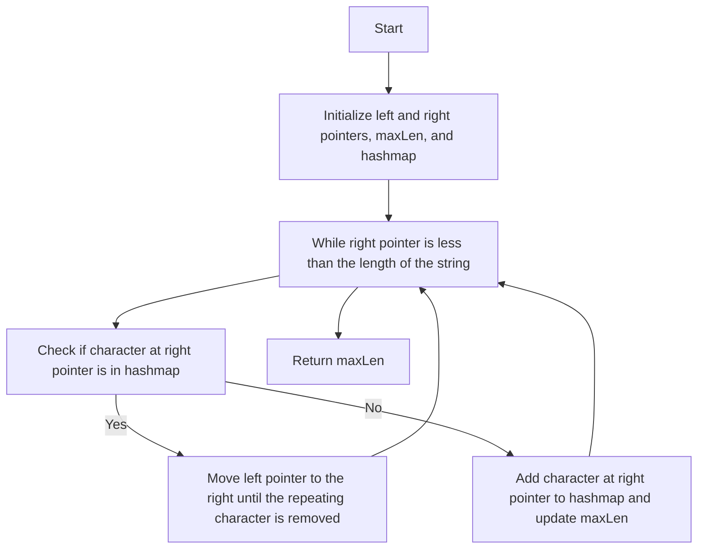

# 3. Longest Substring Without Repeating Characters

## Problem Statement

Given a string `s`, find the length of the longest substring without repeating characters.

### Example 1:
```
Input: s = "abcabcbb"
Output: 3
Explanation: The answer is "abc", with the length of 3.
```

### Example 2:
```
Input: s = "bbbbb"
Output: 1
Explanation: The answer is "b", with the length of 1.   
```

### Example 3:
```
Input: s = "pwwkew"
Output: 3
Explanation: The answer is "wke", with the length of 3.
Notice that the answer must be a substring, "pwke" is a subsequence and not a substring.
``` 

---

## Approach

To solve this problem, we can use the `sliding window` technique. We will maintain a window of characters that does not contain any repeating characters. We will use two pointers, `left` and `right`, to represent the current window.

We need a `hashmap` to know if a character is already in the current window. The keys of the hashmap will be the characters and the values will be the count of occurrences of that character in the current window.

- Traverse the string with the `right` pointer and keep adding characters to the hashmap. 

- If we encounter a character that is already in the hashmap, it means we have a repeating character. In this case, we will move the `left` pointer to the right until we remove the repeating character from the window. We will also update the counts in the hashmap accordingly.

- After processing each character with the `right` pointer, we will update the maximum length of the substring without repeating characters.



---

## Code Implementation:

```cpp
class Solution {
public:
    int lengthOfLongestSubstring(string s) {
        int n = s.length();
        if(n == 0) return 0;
        int left = 0, right = 0, maxLen = 1;
        unordered_map<char, int> mpp;

        while(right < n){
            while(mpp.find(s[right]) != mpp.end()){
                mpp[s[left]]--;
                if(mpp[s[left]] == 0) mpp.erase(s[left]);
                left++;
            }
            maxLen = max(maxLen, right - left + 1);
            mpp[s[right]]++;
            right++;
        }
        
        return maxLen;
    }
};
```

---

## Complexity Analysis

- **Time Complexity**: O(n), where n is the length of the input string `s`. In the worst case, each character will be visited at most twice (once by the `right` pointer and once by the `left` pointer).

- **Space Complexity**: O(min(m, n)), where m is the size of the character set and n is the length of the input string `s`. In the worst case, we may need to store all characters in the current window in the hashmap.

---