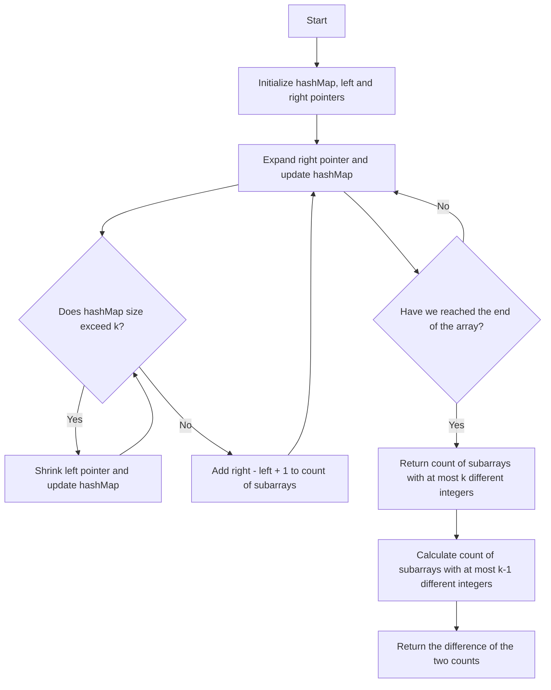

# 992. Subarrays with K Different Integers

## Problem Statement

Given an integer array `nums` and an integer `k`, return the number of good subarrays of `nums`.

A good array is an array where the number of different integers in that array is exactly `k`.

### Example 1:
```
Input: nums = [1,2,1,2,3], k = 2
Output: 7
Explanation: Subarrays formed with exactly 2 different integers: [1,2], [2,1], [1,2], [2,3], [1,2,1], [2,1,2], [1,2,3]
``` 

### Example 2:
```
Input: nums = [1,2,1,3,4], k = 3
Output: 3
Explanation: Subarrays formed with exactly 3 different integers: [1,2,1,3], [2,1,3], [1,3,4]
``` 

---

## Approach

We have to count the number of subarrays that contain exactly `k` different integers. To solve this problem, we can use the sliding window technique. 

For this we can use the `atMostK` technique; where we have to find the number of subarrays with at most `k` different integers and the number of subarrays with at most `k-1` different integers. The difference between these two will give us the number of subarrays with exactly `k` different integers.

**Why does this work?** Because the number of subarrays with at most `k` different integers includes all the subarrays with exactly `k` different integers and all the subarrays with less than `k` different integers. By subtracting the number of subarrays with at most `k-1` different integers, we are left with only the subarrays that have exactly `k` different integers.

- Use a `hashMap` to store the count of each integer in the current window.

- Use two pointers `left` and `right` to represent the current window.

- Expand the `right` pointer to include more elements in the window until we have more than `k` different integers in the window.

- Once we have more than `k` different integers, we can move the `left` pointer to shrink the window until we have at most `k` different integers in the window.

- Keep track of the number of subarrays with at most `k` different integers by adding the number of subarrays that can be formed with the current window size (which is `right - left + 1`) to the count.




---

## Code Implementation

```cpp
class Solution {
public:
    int atMostKSubArrays(vector<int> &nums, int k){
        unordered_map<int, int> mpp;
        int n = nums.size();
        int left = 0, right = 0, subArrays = 0;

        while(right < n){
            mpp[nums[right]]++;
            while(mpp.size() > k){
                mpp[nums[left]]--;
                if(mpp[nums[left]] == 0) mpp.erase(nums[left]);
                left++;
            }            
            subArrays += (right - left + 1);
            right++;
        }
        return subArrays;
    }

    int subarraysWithKDistinct(vector<int>& nums, int k) {
        return atMostKSubArrays(nums, k) - atMostKSubArrays(nums, k - 1);      
    }
};
```

---

## Complexity Analysis

- **Time Complexity**: O(n), where `n` is the length of the input array `nums`. This is because we are traversing the array at most twice (once for each call to `atMostKSubArrays`).

- **Space Complexity**: O(k), where `k` is the number of different integers allowed in the subarrays. This is because we are using a hash map to store the count of integers in the current window, and the size of the hash map can grow up to `k`.

---