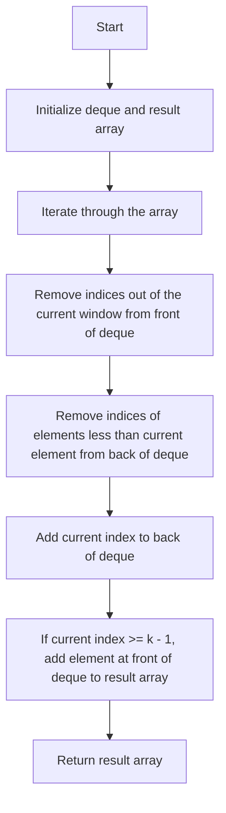

# 239. Sliding Window Maximum

## Problem Statement

You are given an array of integers `nums`, there is a sliding window of size `k` which is moving from the very left of the array to the very right. You can only see the `k` numbers in the window. Each time the sliding window moves right by one position.

Return the max sliding window.


### Example 1:

```
Input: nums = [1,3,-1,-3,5,3,6,7], k = 3
Output: [3,3,5,5,6,7]
Explanation:
Window position                 Max
---------------                ----- 
[1  3  -1] -3  5  3  6  7        3
 1 [3  -1  -3] 5  3  6  7        3
 1  3 [-1  -3   5] 3  6  7       5
 1  3 -1 [-3   5   3] 6  7       5
 1  3 -1 -3 [5   3   6] 7        6
```

---

## Approach

We have to find the maximum value in each sliding window of size `k` in an array. To achieve this, we can use a `deque` (double-ended queue) to maintain the indices of the elements in the current window.

1. We will iterate through the array and for each element, we will remove the indices of the elements from the front of the deque that are out of the current window (i.e., their index is less than `i - k + 1`).

2. We will also remove the indices of the elements from the back of the deque that are `less` than the current element since they `cannot be the maximum` for any future window.

3. We will add the current index to the back of the deque.

4. If the current index is greater than or equal to `k - 1`, we will add the element at the front of the deque (which is the maximum for the current window) to the result array.

5. Finally, we will return the result array containing the maximum values for each sliding window.



---

## Code Implementation

```java
class Solution {
    public int[] maxSlidingWindow(int[] nums, int k) {
        int n = nums.length;
        Deque<Integer> deque = new LinkedList<>();
        
        int[] result = new int[n - k + 1];
        int idx = 0;
        
        for(int i = 0; i < n; i++){
            // Maintaining a sliding window of size k
            while(!deque.isEmpty() && deque.peekFirst() <= i - k){
                deque.pollFirst();
            }

            // Maintaining a decreasing order in the deque
            while(!deque.isEmpty() && nums[i] >= nums[deque.peekLast()]){
                deque.pollLast();
            }

            deque.offerLast(i);
            // Adding to the resultset if the window is valid
            if(i >= k - 1) result[idx++] = nums[deque.peekFirst()];
        }
        
        return result;
    }
}
```

---

## Complexity Analysis

- **Time Complexity**: O(n) where n is the number of elements in the input array. Each element is added and removed from the deque at most once.

- **Space Complexity**: O(k) where k is the size of the sliding window. The deque can hold at most k elements at any time.

---