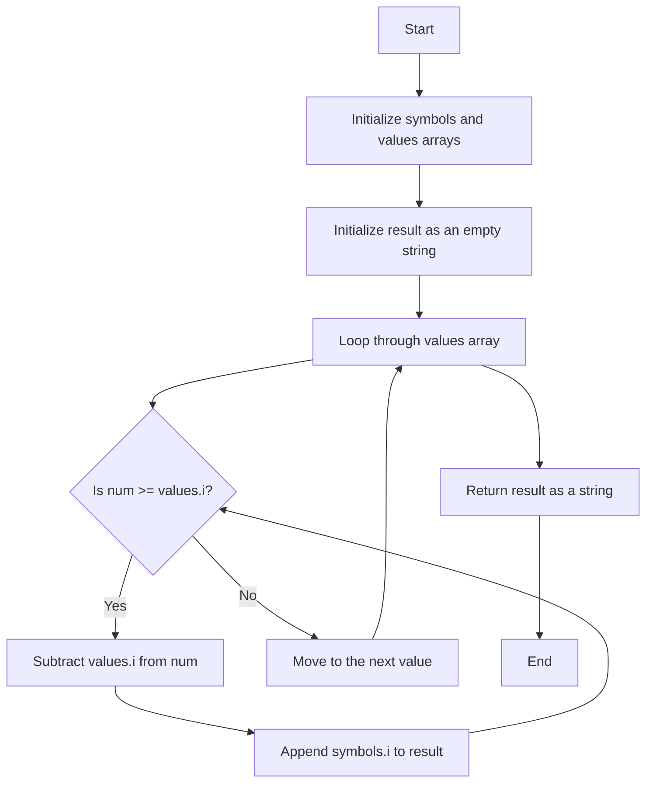

# 12. Integer to Roman

## Problem Statement

Given an integer, convert it to a `Roman` numeral.

Roman numerals are formed by appending the conversions of decimal place values from highest to lowest. Converting a decimal place value into a Roman numeral has the following rules:

| Decimal Place Value | Roman Numeral |
|---------------------|---------------|
| 1                   | I             |
| 5                   | V             | 
| 10                  | X             |
| 50                  | L             |
| 100                 | C             |
| 500                 | D             |
| 1000                | M             |

For example, 1994 is converted to MCMXCIV as follows:
- 1000 = M
- 900 = CM
- 90 = XC
- 4 = IV    
Thus, `M` + `CM` + `XC` + `IV` = `MCMXCIV`.


### Example 1:

```
Input: num = 3
Output: "III"
```

### Example 2:

```
Input: num = 3749
Output: "MMMDCCXLIX"
```

---

## Approach

We have to be `greedy` in our approach. We will start with the highest decimal place value and keep subtracting it from the input number until it is less than that value. For each subtraction, we will append the corresponding Roman numeral to our result string. We will repeat this process for all the decimal place values until we have converted the entire number.



---

## Code Implementation

```java
class Solution {
    public String intToRoman(int num) {
        
        String[] symbols = {
            "M", "CM", "D", "CD", 
            "C", "XC", "L", "XL",
            "X", "IX", "V", "IV", "I"};
        
        int[] values = {
            1000, 900, 500, 400,
            100, 90, 50, 40,
            10, 9, 5, 4, 1};

        StringBuilder result = new StringBuilder();
        for(int i = 0; i < values.length; i++){
            while(num >= values[i]){
                num = num - values[i];
                result.append(symbols[i]);
            }
        }
        return result.toString();
    }
}
```

---

## Complexity Analysis

- **Time Complexity**: O(1) - The number of symbols and values is constant (13), so the loop runs a fixed number of times.

- **Space Complexity**: O(1) - The space used for the symbols and values arrays is constant, and the output string is proportional to the input number but does not affect the overall space complexity.

---